# Ticket Index

*Generated: 2026-03-07 13:07:23*

<details><summary id="b-qi9">Full Regression Test [b.qi9] <code>pupa</code></summary>

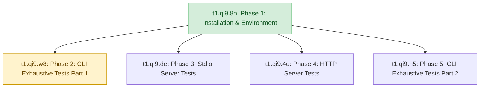

&ensp;&ensp;&ensp;&ensp;[Full Regression Test](b.qi9/b.qi9.md) [b.qi9]

<div style="padding-left: 1.5em">

<details><summary id="t1-qi9-8h">Phase 1: Installation & Environment [t1.qi9.8h] <code>finished</code></summary>

&ensp;&ensp;&ensp;&ensp;[Phase 1: Installation & Environment](b.qi9/t1.qi9.8h/t1.qi9.8h.md) [t1.qi9.8h]

<div style="padding-left: 1.5em">

<details><summary id="t2-qi9-8h-jh">Installation and Bootstrap [t2.qi9.8h.jh] <code>pupa</code></summary>

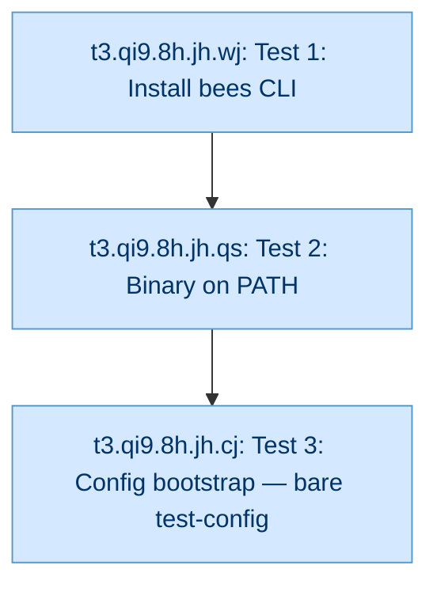

&ensp;&ensp;&ensp;&ensp;[Installation and Bootstrap](b.qi9/t1.qi9.8h/t2.qi9.8h.jh/t2.qi9.8h.jh.md) [t2.qi9.8h.jh]

<div style="padding-left: 1.5em">

<div id="t3-qi9-8h-jh-wj" style="margin-left:1em">

[Test 1: Install bees CLI](b.qi9/t1.qi9.8h/t2.qi9.8h.jh/t3.qi9.8h.jh.wj/t3.qi9.8h.jh.wj.md) [t3.qi9.8h.jh.wj] `pupa`

</div>
<div id="t3-qi9-8h-jh-qs" style="margin-left:1em">

[Test 2: Binary on PATH](b.qi9/t1.qi9.8h/t2.qi9.8h.jh/t3.qi9.8h.jh.qs/t3.qi9.8h.jh.qs.md) [t3.qi9.8h.jh.qs] `pupa`

</div>
<div id="t3-qi9-8h-jh-cj" style="margin-left:1em">

[Test 3: Config bootstrap — bare test-config](b.qi9/t1.qi9.8h/t2.qi9.8h.jh/t3.qi9.8h.jh.cj/t3.qi9.8h.jh.cj.md) [t3.qi9.8h.jh.cj] `pupa`

</div>

</div>
</details>

</div>
</details>
<details><summary id="t1-qi9-w8">Phase 2: CLI Exhaustive Tests (Part 1) [t1.qi9.w8] <code>worker</code></summary>

&ensp;&ensp;&ensp;&ensp;[Phase 2: CLI Exhaustive Tests (Part 1)](b.qi9/t1.qi9.w8/t1.qi9.w8.md) [t1.qi9.w8]

<div style="padding-left: 1.5em">

<div id="t2-qi9-w8-4z" style="margin-left:1em">

[CLI: bees colonize-hive --scope creates scope-keyed entry visible via list-hives](b.qi9/t1.qi9.w8/t2.qi9.w8.4z/t2.qi9.w8.4z.md) [t2.qi9.w8.4z] `pupa`

</div>
<div id="t2-qi9-w8-gp" style="margin-left:1em">

[CLI: bees colonize-hive --scope with invalid pattern returns invalid_scope_pattern error](b.qi9/t1.qi9.w8/t2.qi9.w8.gp/t2.qi9.w8.gp.md) [t2.qi9.w8.gp] `pupa`

</div>
<details><summary id="t2-qi9-w8-63">Dependencies [t2.qi9.w8.63] <code>pupa</code></summary>

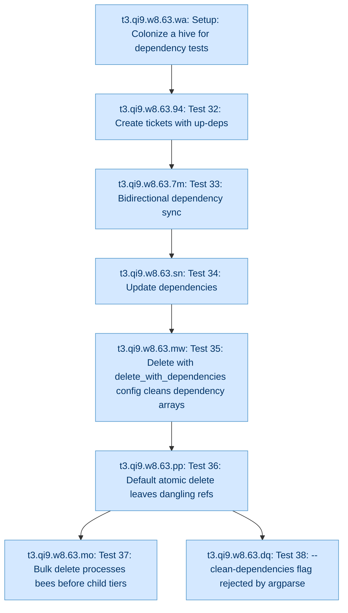

&ensp;&ensp;&ensp;&ensp;[Dependencies](b.qi9/t1.qi9.w8/t2.qi9.w8.63/t2.qi9.w8.63.md) [t2.qi9.w8.63]

<div style="padding-left: 1.5em">

<div id="t3-qi9-w8-63-wa" style="margin-left:1em">

[Setup: Colonize a hive for dependency tests](b.qi9/t1.qi9.w8/t2.qi9.w8.63/t3.qi9.w8.63.wa/t3.qi9.w8.63.wa.md) [t3.qi9.w8.63.wa] `pupa`

</div>
<div id="t3-qi9-w8-63-94" style="margin-left:1em">

[Test 32: Create tickets with up-deps](b.qi9/t1.qi9.w8/t2.qi9.w8.63/t3.qi9.w8.63.94/t3.qi9.w8.63.94.md) [t3.qi9.w8.63.94] `pupa`

</div>
<div id="t3-qi9-w8-63-7m" style="margin-left:1em">

[Test 33: Bidirectional dependency sync](b.qi9/t1.qi9.w8/t2.qi9.w8.63/t3.qi9.w8.63.7m/t3.qi9.w8.63.7m.md) [t3.qi9.w8.63.7m] `pupa`

</div>
<div id="t3-qi9-w8-63-sn" style="margin-left:1em">

[Test 34: Update dependencies](b.qi9/t1.qi9.w8/t2.qi9.w8.63/t3.qi9.w8.63.sn/t3.qi9.w8.63.sn.md) [t3.qi9.w8.63.sn] `pupa`

</div>
<div id="t3-qi9-w8-63-mw" style="margin-left:1em">

[Test 35: Delete with delete_with_dependencies config cleans dependency arrays](b.qi9/t1.qi9.w8/t2.qi9.w8.63/t3.qi9.w8.63.mw/t3.qi9.w8.63.mw.md) [t3.qi9.w8.63.mw] `pupa`

</div>
<div id="t3-qi9-w8-63-pp" style="margin-left:1em">

[Test 36: Default atomic delete leaves dangling refs](b.qi9/t1.qi9.w8/t2.qi9.w8.63/t3.qi9.w8.63.pp/t3.qi9.w8.63.pp.md) [t3.qi9.w8.63.pp] `pupa`

</div>
<div id="t3-qi9-w8-63-mo" style="margin-left:1em">

[Test 37: Bulk delete processes bees before child tiers](b.qi9/t1.qi9.w8/t2.qi9.w8.63/t3.qi9.w8.63.mo/t3.qi9.w8.63.mo.md) [t3.qi9.w8.63.mo] `pupa`

</div>
<div id="t3-qi9-w8-63-dq" style="margin-left:1em">

[Test 38: --clean-dependencies flag rejected by argparse](b.qi9/t1.qi9.w8/t2.qi9.w8.63/t3.qi9.w8.63.dq/t3.qi9.w8.63.dq.md) [t3.qi9.w8.63.dq] `pupa`

</div>

</div>
</details>
<details><summary id="t2-qi9-w8-2e">Egg Resolver [t2.qi9.w8.2e] <code>pupa</code></summary>

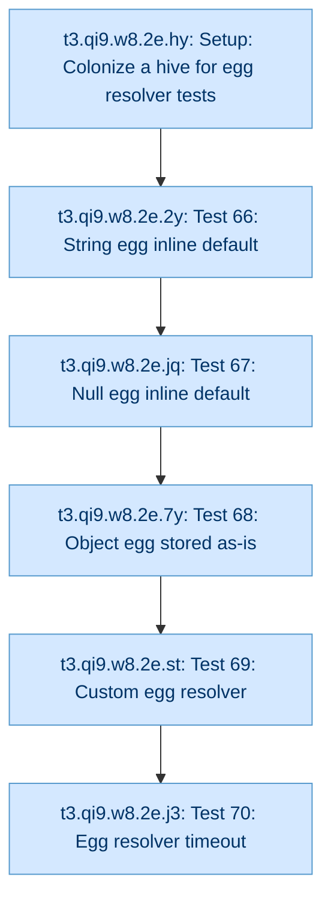

&ensp;&ensp;&ensp;&ensp;[Egg Resolver](b.qi9/t1.qi9.w8/t2.qi9.w8.2e/t2.qi9.w8.2e.md) [t2.qi9.w8.2e]

<div style="padding-left: 1.5em">

<div id="t3-qi9-w8-2e-hy" style="margin-left:1em">

[Setup: Colonize a hive for egg resolver tests](b.qi9/t1.qi9.w8/t2.qi9.w8.2e/t3.qi9.w8.2e.hy/t3.qi9.w8.2e.hy.md) [t3.qi9.w8.2e.hy] `pupa`

</div>
<div id="t3-qi9-w8-2e-2y" style="margin-left:1em">

[Test 66: String egg inline default](b.qi9/t1.qi9.w8/t2.qi9.w8.2e/t3.qi9.w8.2e.2y/t3.qi9.w8.2e.2y.md) [t3.qi9.w8.2e.2y] `pupa`

</div>
<div id="t3-qi9-w8-2e-jq" style="margin-left:1em">

[Test 67: Null egg inline default](b.qi9/t1.qi9.w8/t2.qi9.w8.2e/t3.qi9.w8.2e.jq/t3.qi9.w8.2e.jq.md) [t3.qi9.w8.2e.jq] `pupa`

</div>
<div id="t3-qi9-w8-2e-7y" style="margin-left:1em">

[Test 68: Object egg stored as-is](b.qi9/t1.qi9.w8/t2.qi9.w8.2e/t3.qi9.w8.2e.7y/t3.qi9.w8.2e.7y.md) [t3.qi9.w8.2e.7y] `pupa`

</div>
<div id="t3-qi9-w8-2e-st" style="margin-left:1em">

[Test 69: Custom egg resolver](b.qi9/t1.qi9.w8/t2.qi9.w8.2e/t3.qi9.w8.2e.st/t3.qi9.w8.2e.st.md) [t3.qi9.w8.2e.st] `pupa`

</div>
<div id="t3-qi9-w8-2e-j3" style="margin-left:1em">

[Test 70: Egg resolver timeout](b.qi9/t1.qi9.w8/t2.qi9.w8.2e/t3.qi9.w8.2e.j3/t3.qi9.w8.2e.j3.md) [t3.qi9.w8.2e.j3] `pupa`

</div>

</div>
</details>
<details><summary id="t2-qi9-w8-ev">Error Handling [t2.qi9.w8.ev] <code>pupa</code></summary>

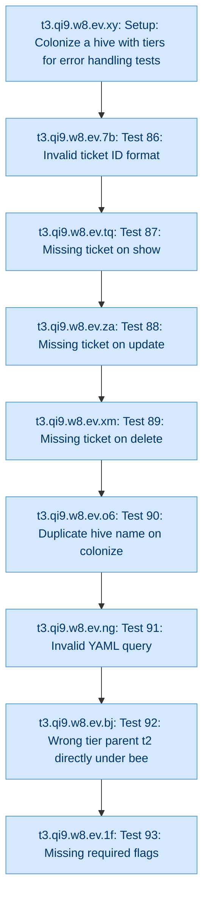

&ensp;&ensp;&ensp;&ensp;[Error Handling](b.qi9/t1.qi9.w8/t2.qi9.w8.ev/t2.qi9.w8.ev.md) [t2.qi9.w8.ev]

<div style="padding-left: 1.5em">

<div id="t3-qi9-w8-ev-xy" style="margin-left:1em">

[Setup: Colonize a hive with tiers for error handling tests](b.qi9/t1.qi9.w8/t2.qi9.w8.ev/t3.qi9.w8.ev.xy/t3.qi9.w8.ev.xy.md) [t3.qi9.w8.ev.xy] `pupa`

</div>
<div id="t3-qi9-w8-ev-7b" style="margin-left:1em">

[Test 86: Invalid ticket ID format](b.qi9/t1.qi9.w8/t2.qi9.w8.ev/t3.qi9.w8.ev.7b/t3.qi9.w8.ev.7b.md) [t3.qi9.w8.ev.7b] `pupa`

</div>
<div id="t3-qi9-w8-ev-tq" style="margin-left:1em">

[Test 87: Missing ticket on show](b.qi9/t1.qi9.w8/t2.qi9.w8.ev/t3.qi9.w8.ev.tq/t3.qi9.w8.ev.tq.md) [t3.qi9.w8.ev.tq] `pupa`

</div>
<div id="t3-qi9-w8-ev-za" style="margin-left:1em">

[Test 88: Missing ticket on update](b.qi9/t1.qi9.w8/t2.qi9.w8.ev/t3.qi9.w8.ev.za/t3.qi9.w8.ev.za.md) [t3.qi9.w8.ev.za] `pupa`

</div>
<div id="t3-qi9-w8-ev-xm" style="margin-left:1em">

[Test 89: Missing ticket on delete](b.qi9/t1.qi9.w8/t2.qi9.w8.ev/t3.qi9.w8.ev.xm/t3.qi9.w8.ev.xm.md) [t3.qi9.w8.ev.xm] `pupa`

</div>
<div id="t3-qi9-w8-ev-o6" style="margin-left:1em">

[Test 90: Duplicate hive name on colonize](b.qi9/t1.qi9.w8/t2.qi9.w8.ev/t3.qi9.w8.ev.o6/t3.qi9.w8.ev.o6.md) [t3.qi9.w8.ev.o6] `pupa`

</div>
<div id="t3-qi9-w8-ev-ng" style="margin-left:1em">

[Test 91: Invalid YAML query](b.qi9/t1.qi9.w8/t2.qi9.w8.ev/t3.qi9.w8.ev.ng/t3.qi9.w8.ev.ng.md) [t3.qi9.w8.ev.ng] `pupa`

</div>
<div id="t3-qi9-w8-ev-bj" style="margin-left:1em">

[Test 92: Wrong tier parent (t2 directly under bee)](b.qi9/t1.qi9.w8/t2.qi9.w8.ev/t3.qi9.w8.ev.bj/t3.qi9.w8.ev.bj.md) [t3.qi9.w8.ev.bj] `pupa`

</div>
<div id="t3-qi9-w8-ev-1f" style="margin-left:1em">

[Test 93: Missing required flags](b.qi9/t1.qi9.w8/t2.qi9.w8.ev/t3.qi9.w8.ev.1f/t3.qi9.w8.ev.1f.md) [t3.qi9.w8.ev.1f] `pupa`

</div>

</div>
</details>
<div id="t2-qi9-w8-44" style="margin-left:1em">

[Fast Parser Pipeline Query Correctness](b.qi9/t1.qi9.w8/t2.qi9.w8.44/t2.qi9.w8.44.md) [t2.qi9.w8.44] `pupa`

</div>
<details><summary id="t2-qi9-w8-nf">Freeform Queries [t2.qi9.w8.nf] <code>pupa</code></summary>

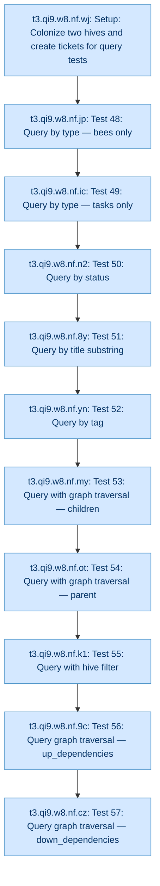

&ensp;&ensp;&ensp;&ensp;[Freeform Queries](b.qi9/t1.qi9.w8/t2.qi9.w8.nf/t2.qi9.w8.nf.md) [t2.qi9.w8.nf]

<div style="padding-left: 1.5em">

<div id="t3-qi9-w8-nf-wj" style="margin-left:1em">

[Setup: Colonize two hives and create tickets for query tests](b.qi9/t1.qi9.w8/t2.qi9.w8.nf/t3.qi9.w8.nf.wj/t3.qi9.w8.nf.wj.md) [t3.qi9.w8.nf.wj] `pupa`

</div>
<div id="t3-qi9-w8-nf-jp" style="margin-left:1em">

[Test 48: Query by type — bees only](b.qi9/t1.qi9.w8/t2.qi9.w8.nf/t3.qi9.w8.nf.jp/t3.qi9.w8.nf.jp.md) [t3.qi9.w8.nf.jp] `pupa`

</div>
<div id="t3-qi9-w8-nf-ic" style="margin-left:1em">

[Test 49: Query by type — tasks only](b.qi9/t1.qi9.w8/t2.qi9.w8.nf/t3.qi9.w8.nf.ic/t3.qi9.w8.nf.ic.md) [t3.qi9.w8.nf.ic] `pupa`

</div>
<div id="t3-qi9-w8-nf-n2" style="margin-left:1em">

[Test 50: Query by status](b.qi9/t1.qi9.w8/t2.qi9.w8.nf/t3.qi9.w8.nf.n2/t3.qi9.w8.nf.n2.md) [t3.qi9.w8.nf.n2] `pupa`

</div>
<div id="t3-qi9-w8-nf-8y" style="margin-left:1em">

[Test 51: Query by title substring](b.qi9/t1.qi9.w8/t2.qi9.w8.nf/t3.qi9.w8.nf.8y/t3.qi9.w8.nf.8y.md) [t3.qi9.w8.nf.8y] `pupa`

</div>
<div id="t3-qi9-w8-nf-yn" style="margin-left:1em">

[Test 52: Query by tag](b.qi9/t1.qi9.w8/t2.qi9.w8.nf/t3.qi9.w8.nf.yn/t3.qi9.w8.nf.yn.md) [t3.qi9.w8.nf.yn] `pupa`

</div>
<div id="t3-qi9-w8-nf-my" style="margin-left:1em">

[Test 53: Query with graph traversal — children](b.qi9/t1.qi9.w8/t2.qi9.w8.nf/t3.qi9.w8.nf.my/t3.qi9.w8.nf.my.md) [t3.qi9.w8.nf.my] `pupa`

</div>
<div id="t3-qi9-w8-nf-ot" style="margin-left:1em">

[Test 54: Query with graph traversal — parent](b.qi9/t1.qi9.w8/t2.qi9.w8.nf/t3.qi9.w8.nf.ot/t3.qi9.w8.nf.ot.md) [t3.qi9.w8.nf.ot] `pupa`

</div>
<div id="t3-qi9-w8-nf-k1" style="margin-left:1em">

[Test 55: Query with hive filter](b.qi9/t1.qi9.w8/t2.qi9.w8.nf/t3.qi9.w8.nf.k1/t3.qi9.w8.nf.k1.md) [t3.qi9.w8.nf.k1] `pupa`

</div>
<div id="t3-qi9-w8-nf-9c" style="margin-left:1em">

[Test 56: Query graph traversal — up_dependencies](b.qi9/t1.qi9.w8/t2.qi9.w8.nf/t3.qi9.w8.nf.9c/t3.qi9.w8.nf.9c.md) [t3.qi9.w8.nf.9c] `pupa`

</div>
<div id="t3-qi9-w8-nf-cz" style="margin-left:1em">

[Test 57: Query graph traversal — down_dependencies](b.qi9/t1.qi9.w8/t2.qi9.w8.nf/t3.qi9.w8.nf.cz/t3.qi9.w8.nf.cz.md) [t3.qi9.w8.nf.cz] `pupa`

</div>

</div>
</details>
<details><summary id="t2-qi9-w8-3v">Hive Management [t2.qi9.w8.3v] <code>pupa</code></summary>

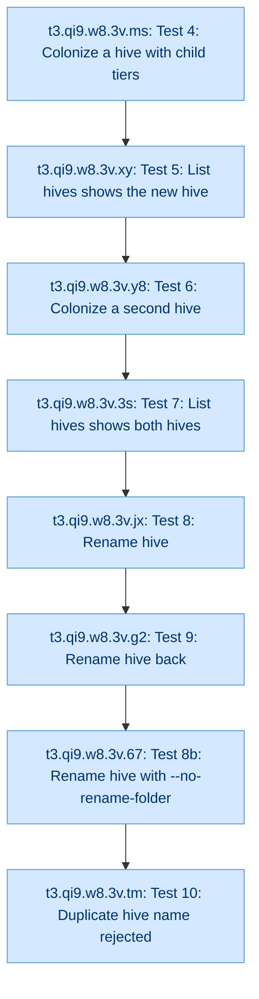

&ensp;&ensp;&ensp;&ensp;[Hive Management](b.qi9/t1.qi9.w8/t2.qi9.w8.3v/t2.qi9.w8.3v.md) [t2.qi9.w8.3v]

<div style="padding-left: 1.5em">

<div id="t3-qi9-w8-3v-ms" style="margin-left:1em">

[Test 4: Colonize a hive with child tiers](b.qi9/t1.qi9.w8/t2.qi9.w8.3v/t3.qi9.w8.3v.ms/t3.qi9.w8.3v.ms.md) [t3.qi9.w8.3v.ms] `pupa`

</div>
<div id="t3-qi9-w8-3v-xy" style="margin-left:1em">

[Test 5: List hives shows the new hive](b.qi9/t1.qi9.w8/t2.qi9.w8.3v/t3.qi9.w8.3v.xy/t3.qi9.w8.3v.xy.md) [t3.qi9.w8.3v.xy] `pupa`

</div>
<div id="t3-qi9-w8-3v-y8" style="margin-left:1em">

[Test 6: Colonize a second hive](b.qi9/t1.qi9.w8/t2.qi9.w8.3v/t3.qi9.w8.3v.y8/t3.qi9.w8.3v.y8.md) [t3.qi9.w8.3v.y8] `pupa`

</div>
<div id="t3-qi9-w8-3v-3s" style="margin-left:1em">

[Test 7: List hives shows both hives](b.qi9/t1.qi9.w8/t2.qi9.w8.3v/t3.qi9.w8.3v.3s/t3.qi9.w8.3v.3s.md) [t3.qi9.w8.3v.3s] `pupa`

</div>
<div id="t3-qi9-w8-3v-jx" style="margin-left:1em">

[Test 8: Rename hive](b.qi9/t1.qi9.w8/t2.qi9.w8.3v/t3.qi9.w8.3v.jx/t3.qi9.w8.3v.jx.md) [t3.qi9.w8.3v.jx] `pupa`

</div>
<div id="t3-qi9-w8-3v-67" style="margin-left:1em">

[Test 8b: Rename hive with --no-rename-folder](b.qi9/t1.qi9.w8/t2.qi9.w8.3v/t3.qi9.w8.3v.67/t3.qi9.w8.3v.67.md) [t3.qi9.w8.3v.67] `pupa`

</div>
<div id="t3-qi9-w8-3v-g2" style="margin-left:1em">

[Test 9: Rename hive back](b.qi9/t1.qi9.w8/t2.qi9.w8.3v/t3.qi9.w8.3v.g2/t3.qi9.w8.3v.g2.md) [t3.qi9.w8.3v.g2] `pupa`

</div>
<div id="t3-qi9-w8-3v-tm" style="margin-left:1em">

[Test 10: Duplicate hive name rejected](b.qi9/t1.qi9.w8/t2.qi9.w8.3v/t3.qi9.w8.3v.tm/t3.qi9.w8.3v.tm.md) [t3.qi9.w8.3v.tm] `pupa`

</div>

</div>
</details>
<div id="t2-qi9-w8-y5" style="margin-left:1em">

[http.port config key is respected by bees serve --http](b.qi9/t1.qi9.w8/t2.qi9.w8.y5/t2.qi9.w8.y5.md) [t2.qi9.w8.y5] `pupa`

</div>
<details><summary id="t2-qi9-w8-mg">ID and GUID Validation [t2.qi9.w8.mg] <code>pupa</code></summary>

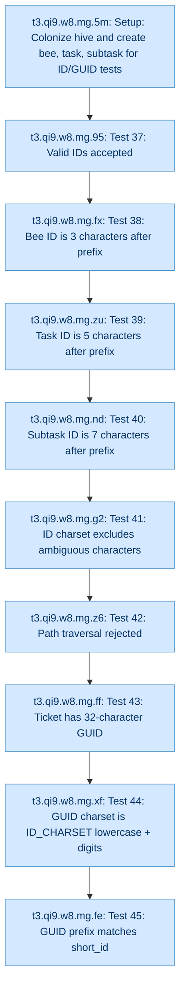

&ensp;&ensp;&ensp;&ensp;[ID and GUID Validation](b.qi9/t1.qi9.w8/t2.qi9.w8.mg/t2.qi9.w8.mg.md) [t2.qi9.w8.mg]

<div style="padding-left: 1.5em">

<div id="t3-qi9-w8-mg-5m" style="margin-left:1em">

[Setup: Colonize hive and create bee, task, subtask for ID/GUID tests](b.qi9/t1.qi9.w8/t2.qi9.w8.mg/t3.qi9.w8.mg.5m/t3.qi9.w8.mg.5m.md) [t3.qi9.w8.mg.5m] `pupa`

</div>
<div id="t3-qi9-w8-mg-95" style="margin-left:1em">

[Test 37: Valid IDs accepted](b.qi9/t1.qi9.w8/t2.qi9.w8.mg/t3.qi9.w8.mg.95/t3.qi9.w8.mg.95.md) [t3.qi9.w8.mg.95] `pupa`

</div>
<div id="t3-qi9-w8-mg-fx" style="margin-left:1em">

[Test 38: Bee ID is 3 characters after prefix](b.qi9/t1.qi9.w8/t2.qi9.w8.mg/t3.qi9.w8.mg.fx/t3.qi9.w8.mg.fx.md) [t3.qi9.w8.mg.fx] `pupa`

</div>
<div id="t3-qi9-w8-mg-zu" style="margin-left:1em">

[Test 39: Task ID is 5 characters after prefix](b.qi9/t1.qi9.w8/t2.qi9.w8.mg/t3.qi9.w8.mg.zu/t3.qi9.w8.mg.zu.md) [t3.qi9.w8.mg.zu] `pupa`

</div>
<div id="t3-qi9-w8-mg-nd" style="margin-left:1em">

[Test 40: Subtask ID is 7 characters after prefix](b.qi9/t1.qi9.w8/t2.qi9.w8.mg/t3.qi9.w8.mg.nd/t3.qi9.w8.mg.nd.md) [t3.qi9.w8.mg.nd] `pupa`

</div>
<div id="t3-qi9-w8-mg-g2" style="margin-left:1em">

[Test 41: ID charset excludes ambiguous characters](b.qi9/t1.qi9.w8/t2.qi9.w8.mg/t3.qi9.w8.mg.g2/t3.qi9.w8.mg.g2.md) [t3.qi9.w8.mg.g2] `pupa`

</div>
<div id="t3-qi9-w8-mg-z6" style="margin-left:1em">

[Test 42: Path traversal rejected](b.qi9/t1.qi9.w8/t2.qi9.w8.mg/t3.qi9.w8.mg.z6/t3.qi9.w8.mg.z6.md) [t3.qi9.w8.mg.z6] `pupa`

</div>
<div id="t3-qi9-w8-mg-ff" style="margin-left:1em">

[Test 43: Ticket has 32-character GUID](b.qi9/t1.qi9.w8/t2.qi9.w8.mg/t3.qi9.w8.mg.ff/t3.qi9.w8.mg.ff.md) [t3.qi9.w8.mg.ff] `pupa`

</div>
<div id="t3-qi9-w8-mg-xf" style="margin-left:1em">

[Test 44: GUID charset is ID_CHARSET (lowercase + digits)](b.qi9/t1.qi9.w8/t2.qi9.w8.mg/t3.qi9.w8.mg.xf/t3.qi9.w8.mg.xf.md) [t3.qi9.w8.mg.xf] `pupa`

</div>
<div id="t3-qi9-w8-mg-fe" style="margin-left:1em">

[Test 45: GUID prefix matches short_id](b.qi9/t1.qi9.w8/t2.qi9.w8.mg/t3.qi9.w8.mg.fe/t3.qi9.w8.mg.fe.md) [t3.qi9.w8.mg.fe] `pupa`

</div>

</div>
</details>
<details><summary id="t2-qi9-w8-p6">ID Charset and Hierarchical IDs [t2.qi9.w8.p6] <code>pupa</code></summary>

&ensp;&ensp;&ensp;&ensp;[ID Charset and Hierarchical IDs](b.qi9/t1.qi9.w8/t2.qi9.w8.p6/t2.qi9.w8.p6.md) [t2.qi9.w8.p6]

<div style="padding-left: 1.5em">

<div id="t3-qi9-w8-p6-br" style="margin-left:1em">

[Test 145: ID format validation — CLI rejects chars excluded from Modified Crockford Base32](b.qi9/t1.qi9.w8/t2.qi9.w8.p6/t3.qi9.w8.p6.br/t3.qi9.w8.p6.br.md) [t3.qi9.w8.p6.br] `pupa`

</div>
<div id="t3-qi9-w8-p6-nd" style="margin-left:1em">

[Test 146: ID lengths — bee=5, t1=9, t2=12 total chars; chars from ID_CHARSET](b.qi9/t1.qi9.w8/t2.qi9.w8.p6/t3.qi9.w8.p6.nd/t3.qi9.w8.p6.nd.md) [t3.qi9.w8.p6.nd] `pupa`

</div>
<div id="t3-qi9-w8-p6-6g" style="margin-left:1em">

[Test 147: 3-level hierarchy — parent/children relationships correct end-to-end](b.qi9/t1.qi9.w8/t2.qi9.w8.p6/t3.qi9.w8.p6.6g/t3.qi9.w8.p6.6g.md) [t3.qi9.w8.p6.6g] `pupa`

</div>

</div>
</details>
<div id="t2-qi9-w8-br" style="margin-left:1em">

[ID format validation: CLI rejects uppercase and non-ID_CHARSET chars](b.qi9/t1.qi9.w8/t2.qi9.w8.br/t2.qi9.w8.br.md) [t2.qi9.w8.br] `pupa`

</div>
<details><summary id="t2-qi9-w8-ma">Index Generation [t2.qi9.w8.ma] <code>pupa</code></summary>

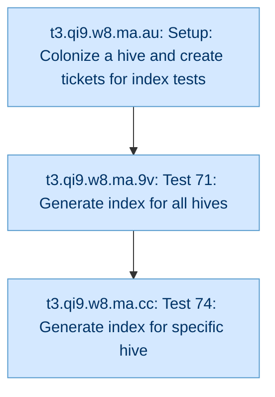

&ensp;&ensp;&ensp;&ensp;[Index Generation](b.qi9/t1.qi9.w8/t2.qi9.w8.ma/t2.qi9.w8.ma.md) [t2.qi9.w8.ma]

<div style="padding-left: 1.5em">

<div id="t3-qi9-w8-ma-au" style="margin-left:1em">

[Setup: Colonize a hive and create tickets for index tests](b.qi9/t1.qi9.w8/t2.qi9.w8.ma/t3.qi9.w8.ma.au/t3.qi9.w8.ma.au.md) [t3.qi9.w8.ma.au] `pupa`

</div>
<div id="t3-qi9-w8-ma-9v" style="margin-left:1em">

[Test 71: Generate index for all hives](b.qi9/t1.qi9.w8/t2.qi9.w8.ma/t3.qi9.w8.ma.9v/t3.qi9.w8.ma.9v.md) [t3.qi9.w8.ma.9v] `pupa`

</div>
<div id="t3-qi9-w8-ma-cc" style="margin-left:1em">

[Test 74: Generate index for specific hive](b.qi9/t1.qi9.w8/t2.qi9.w8.ma/t3.qi9.w8.ma.cc/t3.qi9.w8.ma.cc.md) [t3.qi9.w8.ma.cc] `pupa`

</div>

</div>
</details>
<div id="t2-qi9-w8-5j" style="margin-left:1em">

[list-named-queries returns success and lists registered query](b.qi9/t1.qi9.w8/t2.qi9.w8.5j/t2.qi9.w8.5j.md) [t2.qi9.w8.5j] `pupa`

</div>
<details><summary id="t2-qi9-w8-ry">Move Bee [t2.qi9.w8.ry] <code>pupa</code></summary>

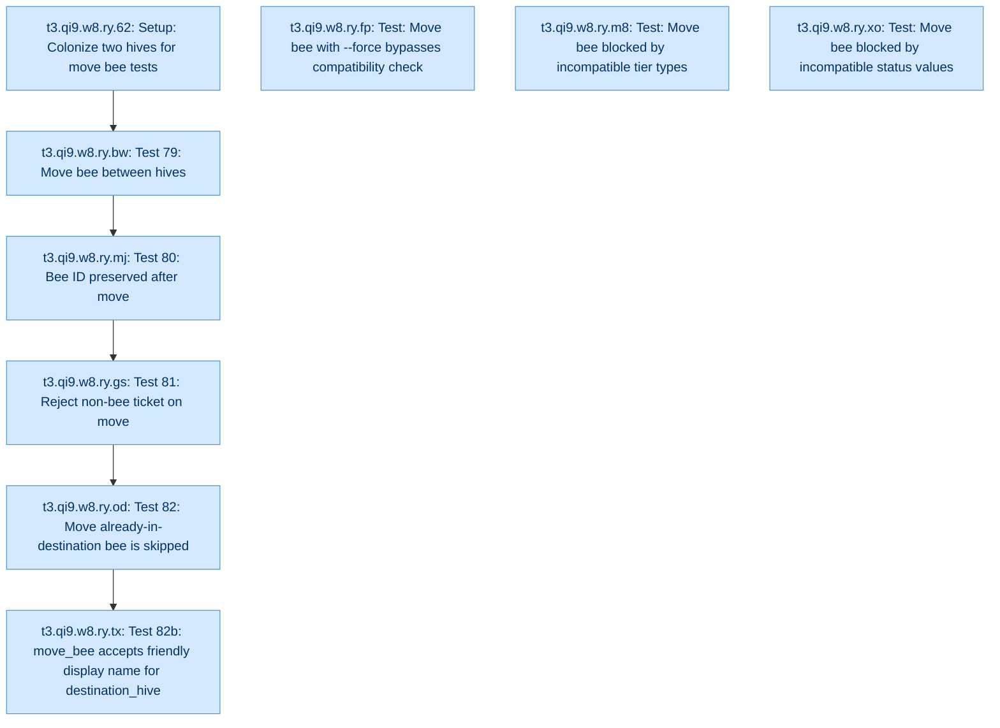

&ensp;&ensp;&ensp;&ensp;[Move Bee](b.qi9/t1.qi9.w8/t2.qi9.w8.ry/t2.qi9.w8.ry.md) [t2.qi9.w8.ry]

<div style="padding-left: 1.5em">

<div id="t3-qi9-w8-ry-62" style="margin-left:1em">

[Setup: Colonize two hives for move bee tests](b.qi9/t1.qi9.w8/t2.qi9.w8.ry/t3.qi9.w8.ry.62/t3.qi9.w8.ry.62.md) [t3.qi9.w8.ry.62] `pupa`

</div>
<div id="t3-qi9-w8-ry-bw" style="margin-left:1em">

[Test 79: Move bee between hives](b.qi9/t1.qi9.w8/t2.qi9.w8.ry/t3.qi9.w8.ry.bw/t3.qi9.w8.ry.bw.md) [t3.qi9.w8.ry.bw] `pupa`

</div>
<div id="t3-qi9-w8-ry-mj" style="margin-left:1em">

[Test 80: Bee ID preserved after move](b.qi9/t1.qi9.w8/t2.qi9.w8.ry/t3.qi9.w8.ry.mj/t3.qi9.w8.ry.mj.md) [t3.qi9.w8.ry.mj] `pupa`

</div>
<div id="t3-qi9-w8-ry-gs" style="margin-left:1em">

[Test 81: Reject non-bee ticket on move](b.qi9/t1.qi9.w8/t2.qi9.w8.ry/t3.qi9.w8.ry.gs/t3.qi9.w8.ry.gs.md) [t3.qi9.w8.ry.gs] `pupa`

</div>
<div id="t3-qi9-w8-ry-od" style="margin-left:1em">

[Test 82: Move already-in-destination bee is skipped](b.qi9/t1.qi9.w8/t2.qi9.w8.ry/t3.qi9.w8.ry.od/t3.qi9.w8.ry.od.md) [t3.qi9.w8.ry.od] `pupa`

</div>
<div id="t3-qi9-w8-ry-tx" style="margin-left:1em">

[Test 82b: move_bee accepts friendly (display) name for destination_hive](b.qi9/t1.qi9.w8/t2.qi9.w8.ry/t3.qi9.w8.ry.tx/t3.qi9.w8.ry.tx.md) [t3.qi9.w8.ry.tx] `pupa`

</div>
<div id="t3-qi9-w8-ry-xo" style="margin-left:1em">

[Test: Move bee blocked by incompatible status values](b.qi9/t1.qi9.w8/t2.qi9.w8.ry/t3.qi9.w8.ry.xo/t3.qi9.w8.ry.xo.md) [t3.qi9.w8.ry.xo] `pupa`

</div>
<div id="t3-qi9-w8-ry-m8" style="margin-left:1em">

[Test: Move bee blocked by incompatible tier types](b.qi9/t1.qi9.w8/t2.qi9.w8.ry/t3.qi9.w8.ry.m8/t3.qi9.w8.ry.m8.md) [t3.qi9.w8.ry.m8] `pupa`

</div>
<div id="t3-qi9-w8-ry-fp" style="margin-left:1em">

[Test: Move bee with --force bypasses compatibility check](b.qi9/t1.qi9.w8/t2.qi9.w8.ry/t3.qi9.w8.ry.fp/t3.qi9.w8.ry.fp.md) [t3.qi9.w8.ry.fp] `pupa`

</div>

</div>
</details>
<details><summary id="t2-qi9-w8-w8">Named Queries [t2.qi9.w8.w8] <code>pupa</code></summary>

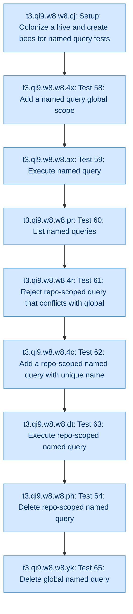

&ensp;&ensp;&ensp;&ensp;[Named Queries](b.qi9/t1.qi9.w8/t2.qi9.w8.w8/t2.qi9.w8.w8.md) [t2.qi9.w8.w8]

<div style="padding-left: 1.5em">

<div id="t3-qi9-w8-w8-cj" style="margin-left:1em">

[Setup: Colonize a hive and create bees for named query tests](b.qi9/t1.qi9.w8/t2.qi9.w8.w8/t3.qi9.w8.w8.cj/t3.qi9.w8.w8.cj.md) [t3.qi9.w8.w8.cj] `pupa`

</div>
<div id="t3-qi9-w8-w8-4x" style="margin-left:1em">

[Test 58: Add a named query (global scope)](b.qi9/t1.qi9.w8/t2.qi9.w8.w8/t3.qi9.w8.w8.4x/t3.qi9.w8.w8.4x.md) [t3.qi9.w8.w8.4x] `pupa`

</div>
<div id="t3-qi9-w8-w8-ax" style="margin-left:1em">

[Test 59: Execute named query](b.qi9/t1.qi9.w8/t2.qi9.w8.w8/t3.qi9.w8.w8.ax/t3.qi9.w8.w8.ax.md) [t3.qi9.w8.w8.ax] `pupa`

</div>
<div id="t3-qi9-w8-w8-pr" style="margin-left:1em">

[Test 60: List named queries](b.qi9/t1.qi9.w8/t2.qi9.w8.w8/t3.qi9.w8.w8.pr/t3.qi9.w8.w8.pr.md) [t3.qi9.w8.w8.pr] `pupa`

</div>
<div id="t3-qi9-w8-w8-4r" style="margin-left:1em">

[Test 61: Reject repo-scoped query that conflicts with global](b.qi9/t1.qi9.w8/t2.qi9.w8.w8/t3.qi9.w8.w8.4r/t3.qi9.w8.w8.4r.md) [t3.qi9.w8.w8.4r] `pupa`

</div>
<div id="t3-qi9-w8-w8-4c" style="margin-left:1em">

[Test 62: Add a repo-scoped named query with unique name](b.qi9/t1.qi9.w8/t2.qi9.w8.w8/t3.qi9.w8.w8.4c/t3.qi9.w8.w8.4c.md) [t3.qi9.w8.w8.4c] `pupa`

</div>
<div id="t3-qi9-w8-w8-dt" style="margin-left:1em">

[Test 63: Execute repo-scoped named query](b.qi9/t1.qi9.w8/t2.qi9.w8.w8/t3.qi9.w8.w8.dt/t3.qi9.w8.w8.dt.md) [t3.qi9.w8.w8.dt] `pupa`

</div>
<div id="t3-qi9-w8-w8-ph" style="margin-left:1em">

[Test 64: Delete repo-scoped named query](b.qi9/t1.qi9.w8/t2.qi9.w8.w8/t3.qi9.w8.w8.ph/t3.qi9.w8.w8.ph.md) [t3.qi9.w8.w8.ph] `pupa`

</div>
<div id="t3-qi9-w8-w8-yk" style="margin-left:1em">

[Test 65: Delete global named query](b.qi9/t1.qi9.w8/t2.qi9.w8.w8/t3.qi9.w8.w8.yk/t3.qi9.w8.w8.yk.md) [t3.qi9.w8.w8.yk] `pupa`

</div>

</div>
</details>
<details><summary id="t2-qi9-w8-og">Sanitizer [t2.qi9.w8.og] <code>pupa</code></summary>

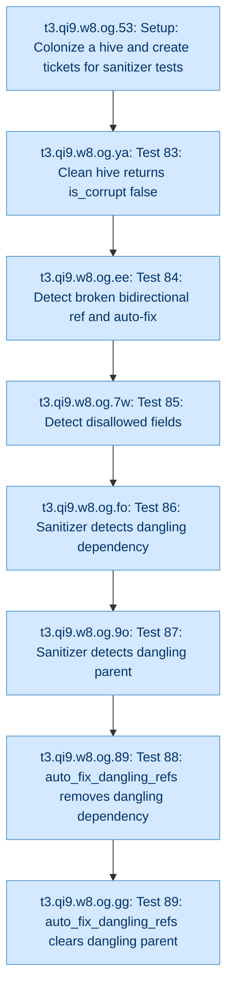

&ensp;&ensp;&ensp;&ensp;[Sanitizer](b.qi9/t1.qi9.w8/t2.qi9.w8.og/t2.qi9.w8.og.md) [t2.qi9.w8.og]

<div style="padding-left: 1.5em">

<div id="t3-qi9-w8-og-53" style="margin-left:1em">

[Setup: Colonize a hive and create tickets for sanitizer tests](b.qi9/t1.qi9.w8/t2.qi9.w8.og/t3.qi9.w8.og.53/t3.qi9.w8.og.53.md) [t3.qi9.w8.og.53] `pupa`

</div>
<div id="t3-qi9-w8-og-ya" style="margin-left:1em">

[Test 83: Clean hive returns is_corrupt false](b.qi9/t1.qi9.w8/t2.qi9.w8.og/t3.qi9.w8.og.ya/t3.qi9.w8.og.ya.md) [t3.qi9.w8.og.ya] `pupa`

</div>
<div id="t3-qi9-w8-og-ee" style="margin-left:1em">

[Test 84: Detect broken bidirectional ref and auto-fix](b.qi9/t1.qi9.w8/t2.qi9.w8.og/t3.qi9.w8.og.ee/t3.qi9.w8.og.ee.md) [t3.qi9.w8.og.ee] `pupa`

</div>
<div id="t3-qi9-w8-og-7w" style="margin-left:1em">

[Test 85: Detect disallowed fields](b.qi9/t1.qi9.w8/t2.qi9.w8.og/t3.qi9.w8.og.7w/t3.qi9.w8.og.7w.md) [t3.qi9.w8.og.7w] `pupa`

</div>
<div id="t3-qi9-w8-og-fo" style="margin-left:1em">

[Test 86: Sanitizer detects dangling dependency](b.qi9/t1.qi9.w8/t2.qi9.w8.og/t3.qi9.w8.og.fo/t3.qi9.w8.og.fo.md) [t3.qi9.w8.og.fo] `pupa`

</div>
<div id="t3-qi9-w8-og-9o" style="margin-left:1em">

[Test 87: Sanitizer detects dangling parent](b.qi9/t1.qi9.w8/t2.qi9.w8.og/t3.qi9.w8.og.9o/t3.qi9.w8.og.9o.md) [t3.qi9.w8.og.9o] `pupa`

</div>
<div id="t3-qi9-w8-og-89" style="margin-left:1em">

[Test 88: auto_fix_dangling_refs removes dangling dependency](b.qi9/t1.qi9.w8/t2.qi9.w8.og/t3.qi9.w8.og.89/t3.qi9.w8.og.89.md) [t3.qi9.w8.og.89] `pupa`

</div>
<div id="t3-qi9-w8-og-gg" style="margin-left:1em">

[Test 89: auto_fix_dangling_refs clears dangling parent](b.qi9/t1.qi9.w8/t2.qi9.w8.og/t3.qi9.w8.og.gg/t3.qi9.w8.og.gg.md) [t3.qi9.w8.og.gg] `pupa`

</div>

</div>
</details>
<details><summary id="t2-qi9-w8-6c">Scope-aware hive registration [t2.qi9.w8.6c] <code>unknown</code></summary>

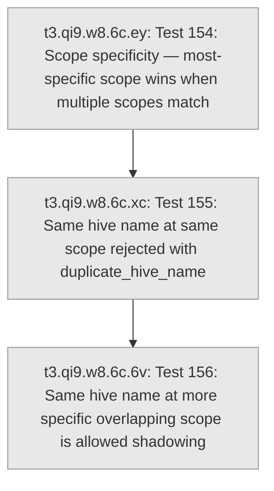

&ensp;&ensp;&ensp;&ensp;[Scope-aware hive registration](b.qi9/t1.qi9.w8/t2.qi9.w8.6c/t2.qi9.w8.6c.md) [t2.qi9.w8.6c]

<div style="padding-left: 1.5em">

<div id="t3-qi9-w8-6c-ey" style="margin-left:1em">

[Test 154: Scope specificity — most-specific scope wins when multiple scopes match](b.qi9/t1.qi9.w8/t2.qi9.w8.6c/t3.qi9.w8.6c.ey/t3.qi9.w8.6c.ey.md) [t3.qi9.w8.6c.ey] `unknown`

</div>
<div id="t3-qi9-w8-6c-xc" style="margin-left:1em">

[Test 155: Same hive name at same scope rejected with duplicate_hive_name](b.qi9/t1.qi9.w8/t2.qi9.w8.6c/t3.qi9.w8.6c.xc/t3.qi9.w8.6c.xc.md) [t3.qi9.w8.6c.xc] `unknown`

</div>
<div id="t3-qi9-w8-6c-6v" style="margin-left:1em">

[Test 156: Same hive name at more specific overlapping scope is allowed (shadowing)](b.qi9/t1.qi9.w8/t2.qi9.w8.6c/t3.qi9.w8.6c.6v/t3.qi9.w8.6c.6v.md) [t3.qi9.w8.6c.6v] `unknown`

</div>

</div>
</details>
<details><summary id="t2-qi9-w8-dj">Setup Command [t2.qi9.w8.dj] <code>unknown</code></summary>

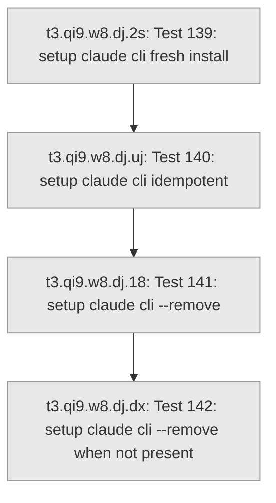

&ensp;&ensp;&ensp;&ensp;[Setup Command](b.qi9/t1.qi9.w8/t2.qi9.w8.dj/t2.qi9.w8.dj.md) [t2.qi9.w8.dj]

<div style="padding-left: 1.5em">

<div id="t3-qi9-w8-dj-2s" style="margin-left:1em">

[Test 139: setup claude cli fresh install](b.qi9/t1.qi9.w8/t2.qi9.w8.dj/t3.qi9.w8.dj.2s/t3.qi9.w8.dj.2s.md) [t3.qi9.w8.dj.2s] `unknown`

</div>
<div id="t3-qi9-w8-dj-uj" style="margin-left:1em">

[Test 140: setup claude cli idempotent](b.qi9/t1.qi9.w8/t2.qi9.w8.dj/t3.qi9.w8.dj.uj/t3.qi9.w8.dj.uj.md) [t3.qi9.w8.dj.uj] `unknown`

</div>
<div id="t3-qi9-w8-dj-18" style="margin-left:1em">

[Test 141: setup claude cli --remove](b.qi9/t1.qi9.w8/t2.qi9.w8.dj/t3.qi9.w8.dj.18/t3.qi9.w8.dj.18.md) [t3.qi9.w8.dj.18] `unknown`

</div>
<div id="t3-qi9-w8-dj-dx" style="margin-left:1em">

[Test 142: setup claude cli --remove when not present](b.qi9/t1.qi9.w8/t2.qi9.w8.dj/t3.qi9.w8.dj.dx/t3.qi9.w8.dj.dx.md) [t3.qi9.w8.dj.dx] `unknown`

</div>

</div>
</details>
<details><summary id="t2-qi9-w8-fx">Setup Command [t2.qi9.w8.fx] <code>pupa</code></summary>

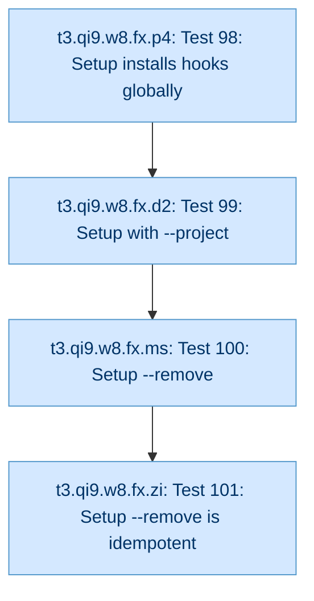

&ensp;&ensp;&ensp;&ensp;[Setup Command](b.qi9/t1.qi9.w8/t2.qi9.w8.fx/t2.qi9.w8.fx.md) [t2.qi9.w8.fx]

<div style="padding-left: 1.5em">

<div id="t3-qi9-w8-fx-p4" style="margin-left:1em">

[Test 98: Setup installs hooks globally](b.qi9/t1.qi9.w8/t2.qi9.w8.fx/t3.qi9.w8.fx.p4/t3.qi9.w8.fx.p4.md) [t3.qi9.w8.fx.p4] `pupa`

</div>
<div id="t3-qi9-w8-fx-d2" style="margin-left:1em">

[Test 99: Setup with --project](b.qi9/t1.qi9.w8/t2.qi9.w8.fx/t3.qi9.w8.fx.d2/t3.qi9.w8.fx.d2.md) [t3.qi9.w8.fx.d2] `pupa`

</div>
<div id="t3-qi9-w8-fx-ms" style="margin-left:1em">

[Test 100: Setup --remove](b.qi9/t1.qi9.w8/t2.qi9.w8.fx/t3.qi9.w8.fx.ms/t3.qi9.w8.fx.ms.md) [t3.qi9.w8.fx.ms] `pupa`

</div>
<div id="t3-qi9-w8-fx-zi" style="margin-left:1em">

[Test 101: Setup --remove is idempotent](b.qi9/t1.qi9.w8/t2.qi9.w8.fx/t3.qi9.w8.fx.zi/t3.qi9.w8.fx.zi.md) [t3.qi9.w8.fx.zi] `pupa`

</div>

</div>
</details>
<details><summary id="t2-qi9-w8-9b">Status Behavior [t2.qi9.w8.9b] <code>pupa</code></summary>

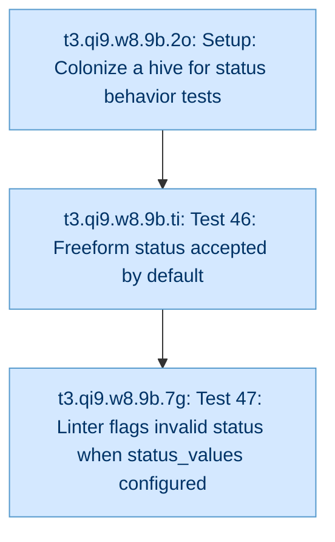

&ensp;&ensp;&ensp;&ensp;[Status Behavior](b.qi9/t1.qi9.w8/t2.qi9.w8.9b/t2.qi9.w8.9b.md) [t2.qi9.w8.9b]

<div style="padding-left: 1.5em">

<div id="t3-qi9-w8-9b-2o" style="margin-left:1em">

[Setup: Colonize a hive for status behavior tests](b.qi9/t1.qi9.w8/t2.qi9.w8.9b/t3.qi9.w8.9b.2o/t3.qi9.w8.9b.2o.md) [t3.qi9.w8.9b.2o] `pupa`

</div>
<div id="t3-qi9-w8-9b-ti" style="margin-left:1em">

[Test 46: Freeform status accepted by default](b.qi9/t1.qi9.w8/t2.qi9.w8.9b/t3.qi9.w8.9b.ti/t3.qi9.w8.9b.ti.md) [t3.qi9.w8.9b.ti] `pupa`

</div>
<div id="t3-qi9-w8-9b-7g" style="margin-left:1em">

[Test 47: Linter flags invalid status when status_values configured](b.qi9/t1.qi9.w8/t2.qi9.w8.9b/t3.qi9.w8.9b.7g/t3.qi9.w8.9b.7g.md) [t3.qi9.w8.9b.7g] `pupa`

</div>

</div>
</details>
<details><summary id="t2-qi9-w8-g8">Status Values [t2.qi9.w8.g8] <code>pupa</code></summary>

```mermaid
graph TD
  classDef larva fill:#e8e8e8,stroke:#999,color:#333,min-width:832px
  classDef pupa fill:#d4e8ff,stroke:#5599cc,color:#003366,min-width:832px
  classDef worker fill:#fff3cd,stroke:#cc9900,color:#664400,min-width:832px
  classDef finished fill:#d4edda,stroke:#28a745,color:#1a5c2a,min-width:832px
  classDef failed fill:#f8d7da,stroke:#dc3545,color:#721c24,min-width:832px

  t3_qi9_w8_g8_2c["t3.qi9.w8.g8.2c: Test 133: get-status-values with mixed config"]:::pupa
  t3_qi9_w8_g8_2t["t3.qi9.w8.g8.2t: Test 127: set-status-values at global scope"]:::pupa
  t3_qi9_w8_g8_53["t3.qi9.w8.g8.53: Test 128: set-status-values at repo_scope"]:::pupa
  t3_qi9_w8_g8_6j["t3.qi9.w8.g8.6j: Test 130: Unset status values at global scope"]:::pupa
  t3_qi9_w8_g8_85["t3.qi9.w8.g8.85: Test 131: set-status-values error — missing_status_values"]:::pupa
  t3_qi9_w8_g8_9q["t3.qi9.w8.g8.9q: Test 134: get-status-values — no matching scope"]:::pupa
  t3_qi9_w8_g8_i6["t3.qi9.w8.g8.i6: Setup: Colonize a hive for status values tests"]:::pupa
  t3_qi9_w8_g8_kw["t3.qi9.w8.g8.kw: Test 132: set-status-values error — missing_hive_name"]:::pupa
  t3_qi9_w8_g8_qw["t3.qi9.w8.g8.qw: Test 135: Create ticket with status_values configured but no status — error"]:::pupa
  t3_qi9_w8_g8_y9["t3.qi9.w8.g8.y9: Test 138: Create ticket with invalid status value when status_values configured"]:::pupa
  t3_qi9_w8_g8_ya["t3.qi9.w8.g8.ya: Test 129: set-status-values at hive scope"]:::pupa
  t3_qi9_w8_g8_yt["t3.qi9.w8.g8.yt: Test 136: Create ticket with no status_values and no status — succeeds with null status"]:::pupa
  t3_qi9_w8_g8_i6 --> t3_qi9_w8_g8_2t
  t3_qi9_w8_g8_2t --> t3_qi9_w8_g8_53
  t3_qi9_w8_g8_53 --> t3_qi9_w8_g8_ya
  t3_qi9_w8_g8_ya --> t3_qi9_w8_g8_6j
  t3_qi9_w8_g8_6j --> t3_qi9_w8_g8_85
  t3_qi9_w8_g8_85 --> t3_qi9_w8_g8_kw
  t3_qi9_w8_g8_kw --> t3_qi9_w8_g8_2c
  t3_qi9_w8_g8_2c --> t3_qi9_w8_g8_9q
  t3_qi9_w8_g8_9q --> t3_qi9_w8_g8_qw
  t3_qi9_w8_g8_qw --> t3_qi9_w8_g8_yt
  t3_qi9_w8_g8_yt --> t3_qi9_w8_g8_y9
```

&ensp;&ensp;&ensp;&ensp;[Status Values](b.qi9/t1.qi9.w8/t2.qi9.w8.g8/t2.qi9.w8.g8.md) [t2.qi9.w8.g8]

<div style="padding-left: 1.5em">

<div id="t3-qi9-w8-g8-i6" style="margin-left:1em">

[Setup: Colonize a hive for status values tests](b.qi9/t1.qi9.w8/t2.qi9.w8.g8/t3.qi9.w8.g8.i6/t3.qi9.w8.g8.i6.md) [t3.qi9.w8.g8.i6] `pupa`

</div>
<div id="t3-qi9-w8-g8-2t" style="margin-left:1em">

[Test 127: set-status-values at global scope](b.qi9/t1.qi9.w8/t2.qi9.w8.g8/t3.qi9.w8.g8.2t/t3.qi9.w8.g8.2t.md) [t3.qi9.w8.g8.2t] `pupa`

</div>
<div id="t3-qi9-w8-g8-53" style="margin-left:1em">

[Test 128: set-status-values at repo_scope](b.qi9/t1.qi9.w8/t2.qi9.w8.g8/t3.qi9.w8.g8.53/t3.qi9.w8.g8.53.md) [t3.qi9.w8.g8.53] `pupa`

</div>
<div id="t3-qi9-w8-g8-ya" style="margin-left:1em">

[Test 129: set-status-values at hive scope](b.qi9/t1.qi9.w8/t2.qi9.w8.g8/t3.qi9.w8.g8.ya/t3.qi9.w8.g8.ya.md) [t3.qi9.w8.g8.ya] `pupa`

</div>
<div id="t3-qi9-w8-g8-6j" style="margin-left:1em">

[Test 130: Unset status values at global scope](b.qi9/t1.qi9.w8/t2.qi9.w8.g8/t3.qi9.w8.g8.6j/t3.qi9.w8.g8.6j.md) [t3.qi9.w8.g8.6j] `pupa`

</div>
<div id="t3-qi9-w8-g8-85" style="margin-left:1em">

[Test 131: set-status-values error — missing_status_values](b.qi9/t1.qi9.w8/t2.qi9.w8.g8/t3.qi9.w8.g8.85/t3.qi9.w8.g8.85.md) [t3.qi9.w8.g8.85] `pupa`

</div>
<div id="t3-qi9-w8-g8-kw" style="margin-left:1em">

[Test 132: set-status-values error — missing_hive_name](b.qi9/t1.qi9.w8/t2.qi9.w8.g8/t3.qi9.w8.g8.kw/t3.qi9.w8.g8.kw.md) [t3.qi9.w8.g8.kw] `pupa`

</div>
<div id="t3-qi9-w8-g8-2c" style="margin-left:1em">

[Test 133: get-status-values with mixed config](b.qi9/t1.qi9.w8/t2.qi9.w8.g8/t3.qi9.w8.g8.2c/t3.qi9.w8.g8.2c.md) [t3.qi9.w8.g8.2c] `pupa`

</div>
<div id="t3-qi9-w8-g8-9q" style="margin-left:1em">

[Test 134: get-status-values — no matching scope](b.qi9/t1.qi9.w8/t2.qi9.w8.g8/t3.qi9.w8.g8.9q/t3.qi9.w8.g8.9q.md) [t3.qi9.w8.g8.9q] `pupa`

</div>
<div id="t3-qi9-w8-g8-qw" style="margin-left:1em">

[Test 135: Create ticket with status_values configured but no status — error](b.qi9/t1.qi9.w8/t2.qi9.w8.g8/t3.qi9.w8.g8.qw/t3.qi9.w8.g8.qw.md) [t3.qi9.w8.g8.qw] `pupa`

</div>
<div id="t3-qi9-w8-g8-yt" style="margin-left:1em">

[Test 136: Create ticket with no status_values and no status — succeeds with null status](b.qi9/t1.qi9.w8/t2.qi9.w8.g8/t3.qi9.w8.g8.yt/t3.qi9.w8.g8.yt.md) [t3.qi9.w8.g8.yt] `pupa`

</div>
<div id="t3-qi9-w8-g8-y9" style="margin-left:1em">

[Test 138: Create ticket with invalid status value when status_values configured](b.qi9/t1.qi9.w8/t2.qi9.w8.g8/t3.qi9.w8.g8.y9/t3.qi9.w8.g8.y9.md) [t3.qi9.w8.g8.y9] `pupa`

</div>

</div>
</details>
<details><summary id="t2-qi9-w8-7t">Sting Command [t2.qi9.w8.7t] <code>pupa</code></summary>

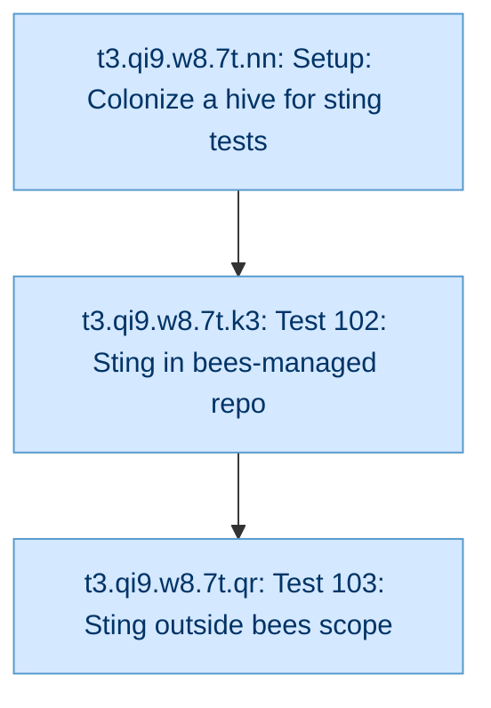

&ensp;&ensp;&ensp;&ensp;[Sting Command](b.qi9/t1.qi9.w8/t2.qi9.w8.7t/t2.qi9.w8.7t.md) [t2.qi9.w8.7t]

<div style="padding-left: 1.5em">

<div id="t3-qi9-w8-7t-nn" style="margin-left:1em">

[Setup: Colonize a hive for sting tests](b.qi9/t1.qi9.w8/t2.qi9.w8.7t/t3.qi9.w8.7t.nn/t3.qi9.w8.7t.nn.md) [t3.qi9.w8.7t.nn] `pupa`

</div>
<div id="t3-qi9-w8-7t-k3" style="margin-left:1em">

[Test 102: Sting in bees-managed repo](b.qi9/t1.qi9.w8/t2.qi9.w8.7t/t3.qi9.w8.7t.k3/t3.qi9.w8.7t.k3.md) [t3.qi9.w8.7t.k3] `pupa`

</div>
<div id="t3-qi9-w8-7t-qr" style="margin-left:1em">

[Test 103: Sting outside bees scope](b.qi9/t1.qi9.w8/t2.qi9.w8.7t/t3.qi9.w8.7t.qr/t3.qi9.w8.7t.qr.md) [t3.qi9.w8.7t.qr] `pupa`

</div>

</div>
</details>
<div id="t2-qi9-w8-t8" style="margin-left:1em">

[T9 cap enforcement: child tiers deeper than T9 produce clear error](b.qi9/t1.qi9.w8/t2.qi9.w8.t8/t2.qi9.w8.t8.md) [t2.qi9.w8.t8] `pupa`

</div>
<details><summary id="t2-qi9-w8-61">Test Config Mode [t2.qi9.w8.61] <code>pupa</code></summary>

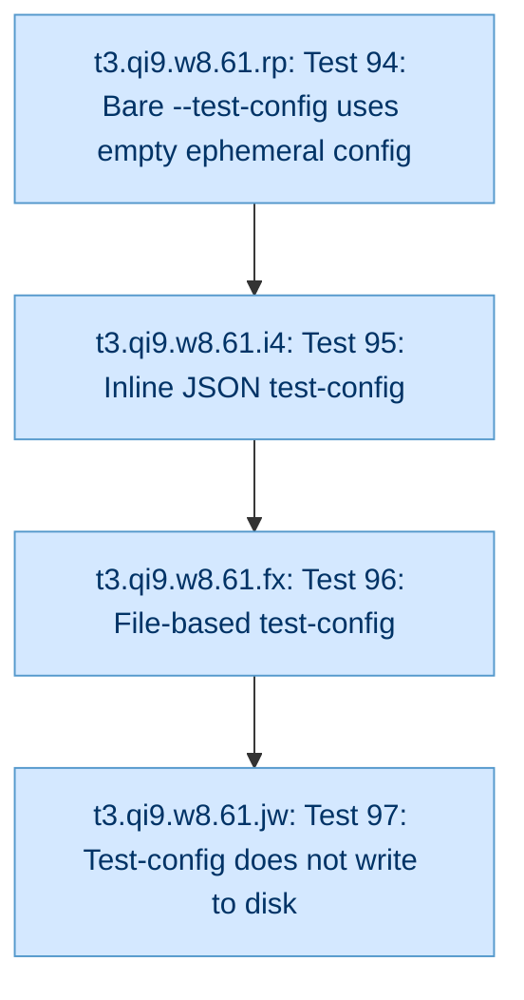

&ensp;&ensp;&ensp;&ensp;[Test Config Mode](b.qi9/t1.qi9.w8/t2.qi9.w8.61/t2.qi9.w8.61.md) [t2.qi9.w8.61]

<div style="padding-left: 1.5em">

<div id="t3-qi9-w8-61-rp" style="margin-left:1em">

[Test 94: Bare --test-config uses empty ephemeral config](b.qi9/t1.qi9.w8/t2.qi9.w8.61/t3.qi9.w8.61.rp/t3.qi9.w8.61.rp.md) [t3.qi9.w8.61.rp] `pupa`

</div>
<div id="t3-qi9-w8-61-i4" style="margin-left:1em">

[Test 95: Inline JSON test-config](b.qi9/t1.qi9.w8/t2.qi9.w8.61/t3.qi9.w8.61.i4/t3.qi9.w8.61.i4.md) [t3.qi9.w8.61.i4] `pupa`

</div>
<div id="t3-qi9-w8-61-fx" style="margin-left:1em">

[Test 96: File-based test-config](b.qi9/t1.qi9.w8/t2.qi9.w8.61/t3.qi9.w8.61.fx/t3.qi9.w8.61.fx.md) [t3.qi9.w8.61.fx] `pupa`

</div>
<div id="t3-qi9-w8-61-jw" style="margin-left:1em">

[Test 97: Test-config does not write to disk](b.qi9/t1.qi9.w8/t2.qi9.w8.61/t3.qi9.w8.61.jw/t3.qi9.w8.61.jw.md) [t3.qi9.w8.61.jw] `pupa`

</div>

</div>
</details>
<details><summary id="t2-qi9-w8-d9">Ticket CRUD [t2.qi9.w8.d9] <code>pupa</code></summary>

```mermaid
graph TD
  classDef larva fill:#e8e8e8,stroke:#999,color:#333,min-width:632px
  classDef pupa fill:#d4e8ff,stroke:#5599cc,color:#003366,min-width:632px
  classDef worker fill:#fff3cd,stroke:#cc9900,color:#664400,min-width:632px
  classDef finished fill:#d4edda,stroke:#28a745,color:#1a5c2a,min-width:632px
  classDef failed fill:#f8d7da,stroke:#dc3545,color:#721c24,min-width:632px

  t3_qi9_w8_d9_1s["t3.qi9.w8.d9.1s: Test 30: Reject parent change on update"]:::pupa
  t3_qi9_w8_d9_2o["t3.qi9.w8.d9.2o: Test 26: Clear tags with null"]:::pupa
  t3_qi9_w8_d9_4g["t3.qi9.w8.d9.4g: Test 18: Create a Task under the first bee"]:::pupa
  t3_qi9_w8_d9_5z["t3.qi9.w8.d9.5z: Test 22: Update ticket title"]:::pupa
  t3_qi9_w8_d9_6i["t3.qi9.w8.d9.6i: Update ticket using --add-tags and --remove-tags"]:::pupa
  t3_qi9_w8_d9_77["t3.qi9.w8.d9.77: Test 23: Update ticket status"]:::pupa
  t3_qi9_w8_d9_87["t3.qi9.w8.d9.87: Test 31: Cascading delete"]:::pupa
  t3_qi9_w8_d9_a2["t3.qi9.w8.d9.a2: Test 27: Delete single ticket leaf"]:::pupa
  t3_qi9_w8_d9_az["t3.qi9.w8.d9.az: Test 25: Update ticket egg"]:::pupa
  t3_qi9_w8_d9_d9["t3.qi9.w8.d9.d9: Test 137: update-ticket rejects parent and children parameters"]:::pupa
  t3_qi9_w8_d9_et["t3.qi9.w8.d9.et: Test 29: Parent-child bidirectional sync"]:::pupa
  t3_qi9_w8_d9_fw["t3.qi9.w8.d9.fw: Test 28: Delete bulk tickets"]:::pupa
  t3_qi9_w8_d9_hv["t3.qi9.w8.d9.hv: Test 20: Show single ticket"]:::pupa
  t3_qi9_w8_d9_ie["t3.qi9.w8.d9.ie: Test 17: Create a second bee ticket"]:::pupa
  t3_qi9_w8_d9_s2["t3.qi9.w8.d9.s2: Test 21: Show bulk tickets"]:::pupa
  t3_qi9_w8_d9_th["t3.qi9.w8.d9.th: Test 24: Update ticket tags"]:::pupa
  t3_qi9_w8_d9_wb["t3.qi9.w8.d9.wb: Test 16: Create a bee ticket"]:::pupa
  t3_qi9_w8_d9_xk["t3.qi9.w8.d9.xk: Setup: Colonize a hive with t1/t2 tiers for CRUD tests"]:::pupa
  t3_qi9_w8_d9_zt["t3.qi9.w8.d9.zt: Test 19: Create a Subtask under the task"]:::pupa
  t3_qi9_w8_d9_xk --> t3_qi9_w8_d9_wb
  t3_qi9_w8_d9_wb --> t3_qi9_w8_d9_ie
  t3_qi9_w8_d9_ie --> t3_qi9_w8_d9_4g
  t3_qi9_w8_d9_4g --> t3_qi9_w8_d9_zt
  t3_qi9_w8_d9_zt --> t3_qi9_w8_d9_hv
  t3_qi9_w8_d9_hv --> t3_qi9_w8_d9_s2
  t3_qi9_w8_d9_s2 --> t3_qi9_w8_d9_5z
  t3_qi9_w8_d9_5z --> t3_qi9_w8_d9_77
  t3_qi9_w8_d9_77 --> t3_qi9_w8_d9_th
  t3_qi9_w8_d9_th --> t3_qi9_w8_d9_az
  t3_qi9_w8_d9_az --> t3_qi9_w8_d9_2o
  t3_qi9_w8_d9_2o --> t3_qi9_w8_d9_a2
  t3_qi9_w8_d9_a2 --> t3_qi9_w8_d9_fw
  t3_qi9_w8_d9_fw --> t3_qi9_w8_d9_et
  t3_qi9_w8_d9_et --> t3_qi9_w8_d9_1s
  t3_qi9_w8_d9_1s --> t3_qi9_w8_d9_87
  t3_qi9_w8_d9_87 --> t3_qi9_w8_d9_d9
```

&ensp;&ensp;&ensp;&ensp;[Ticket CRUD](b.qi9/t1.qi9.w8/t2.qi9.w8.d9/t2.qi9.w8.d9.md) [t2.qi9.w8.d9]

<div style="padding-left: 1.5em">

<div id="t3-qi9-w8-d9-xk" style="margin-left:1em">

[Setup: Colonize a hive with t1/t2 tiers for CRUD tests](b.qi9/t1.qi9.w8/t2.qi9.w8.d9/t3.qi9.w8.d9.xk/t3.qi9.w8.d9.xk.md) [t3.qi9.w8.d9.xk] `pupa`

</div>
<div id="t3-qi9-w8-d9-wb" style="margin-left:1em">

[Test 16: Create a bee ticket](b.qi9/t1.qi9.w8/t2.qi9.w8.d9/t3.qi9.w8.d9.wb/t3.qi9.w8.d9.wb.md) [t3.qi9.w8.d9.wb] `pupa`

</div>
<div id="t3-qi9-w8-d9-ie" style="margin-left:1em">

[Test 17: Create a second bee ticket](b.qi9/t1.qi9.w8/t2.qi9.w8.d9/t3.qi9.w8.d9.ie/t3.qi9.w8.d9.ie.md) [t3.qi9.w8.d9.ie] `pupa`

</div>
<div id="t3-qi9-w8-d9-4g" style="margin-left:1em">

[Test 18: Create a Task under the first bee](b.qi9/t1.qi9.w8/t2.qi9.w8.d9/t3.qi9.w8.d9.4g/t3.qi9.w8.d9.4g.md) [t3.qi9.w8.d9.4g] `pupa`

</div>
<div id="t3-qi9-w8-d9-zt" style="margin-left:1em">

[Test 19: Create a Subtask under the task](b.qi9/t1.qi9.w8/t2.qi9.w8.d9/t3.qi9.w8.d9.zt/t3.qi9.w8.d9.zt.md) [t3.qi9.w8.d9.zt] `pupa`

</div>
<div id="t3-qi9-w8-d9-hv" style="margin-left:1em">

[Test 20: Show single ticket](b.qi9/t1.qi9.w8/t2.qi9.w8.d9/t3.qi9.w8.d9.hv/t3.qi9.w8.d9.hv.md) [t3.qi9.w8.d9.hv] `pupa`

</div>
<div id="t3-qi9-w8-d9-s2" style="margin-left:1em">

[Test 21: Show bulk tickets](b.qi9/t1.qi9.w8/t2.qi9.w8.d9/t3.qi9.w8.d9.s2/t3.qi9.w8.d9.s2.md) [t3.qi9.w8.d9.s2] `pupa`

</div>
<div id="t3-qi9-w8-d9-5z" style="margin-left:1em">

[Test 22: Update ticket title](b.qi9/t1.qi9.w8/t2.qi9.w8.d9/t3.qi9.w8.d9.5z/t3.qi9.w8.d9.5z.md) [t3.qi9.w8.d9.5z] `pupa`

</div>
<div id="t3-qi9-w8-d9-77" style="margin-left:1em">

[Test 23: Update ticket status](b.qi9/t1.qi9.w8/t2.qi9.w8.d9/t3.qi9.w8.d9.77/t3.qi9.w8.d9.77.md) [t3.qi9.w8.d9.77] `pupa`

</div>
<div id="t3-qi9-w8-d9-th" style="margin-left:1em">

[Test 24: Update ticket tags](b.qi9/t1.qi9.w8/t2.qi9.w8.d9/t3.qi9.w8.d9.th/t3.qi9.w8.d9.th.md) [t3.qi9.w8.d9.th] `pupa`

</div>
<div id="t3-qi9-w8-d9-az" style="margin-left:1em">

[Test 25: Update ticket egg](b.qi9/t1.qi9.w8/t2.qi9.w8.d9/t3.qi9.w8.d9.az/t3.qi9.w8.d9.az.md) [t3.qi9.w8.d9.az] `pupa`

</div>
<div id="t3-qi9-w8-d9-2o" style="margin-left:1em">

[Test 26: Clear tags with null](b.qi9/t1.qi9.w8/t2.qi9.w8.d9/t3.qi9.w8.d9.2o/t3.qi9.w8.d9.2o.md) [t3.qi9.w8.d9.2o] `pupa`

</div>
<div id="t3-qi9-w8-d9-a2" style="margin-left:1em">

[Test 27: Delete single ticket (leaf)](b.qi9/t1.qi9.w8/t2.qi9.w8.d9/t3.qi9.w8.d9.a2/t3.qi9.w8.d9.a2.md) [t3.qi9.w8.d9.a2] `pupa`

</div>
<div id="t3-qi9-w8-d9-fw" style="margin-left:1em">

[Test 28: Delete bulk tickets](b.qi9/t1.qi9.w8/t2.qi9.w8.d9/t3.qi9.w8.d9.fw/t3.qi9.w8.d9.fw.md) [t3.qi9.w8.d9.fw] `pupa`

</div>
<div id="t3-qi9-w8-d9-et" style="margin-left:1em">

[Test 29: Parent-child bidirectional sync](b.qi9/t1.qi9.w8/t2.qi9.w8.d9/t3.qi9.w8.d9.et/t3.qi9.w8.d9.et.md) [t3.qi9.w8.d9.et] `pupa`

</div>
<div id="t3-qi9-w8-d9-1s" style="margin-left:1em">

[Test 30: Reject parent change on update](b.qi9/t1.qi9.w8/t2.qi9.w8.d9/t3.qi9.w8.d9.1s/t3.qi9.w8.d9.1s.md) [t3.qi9.w8.d9.1s] `pupa`

</div>
<div id="t3-qi9-w8-d9-87" style="margin-left:1em">

[Test 31: Cascading delete](b.qi9/t1.qi9.w8/t2.qi9.w8.d9/t3.qi9.w8.d9.87/t3.qi9.w8.d9.87.md) [t3.qi9.w8.d9.87] `pupa`

</div>
<div id="t3-qi9-w8-d9-d9" style="margin-left:1em">

[Test 137: update-ticket rejects parent and children parameters](b.qi9/t1.qi9.w8/t2.qi9.w8.d9/t3.qi9.w8.d9.d9/t3.qi9.w8.d9.d9.md) [t3.qi9.w8.d9.d9] `pupa`

</div>
<div id="t3-qi9-w8-d9-6i" style="margin-left:1em">

[Update ticket using --add-tags and --remove-tags](b.qi9/t1.qi9.w8/t2.qi9.w8.d9/t3.qi9.w8.d9.6i/t3.qi9.w8.d9.6i.md) [t3.qi9.w8.d9.6i] `pupa`

</div>

</div>
</details>
<details><summary id="t2-qi9-w8-rt">Tier Configuration [t2.qi9.w8.rt] <code>pupa</code></summary>

```mermaid
graph TD
  classDef larva fill:#e8e8e8,stroke:#999,color:#333,min-width:536px
  classDef pupa fill:#d4e8ff,stroke:#5599cc,color:#003366,min-width:536px
  classDef worker fill:#fff3cd,stroke:#cc9900,color:#664400,min-width:536px
  classDef finished fill:#d4edda,stroke:#28a745,color:#1a5c2a,min-width:536px
  classDef failed fill:#f8d7da,stroke:#dc3545,color:#721c24,min-width:536px

  t3_qi9_w8_rt_3d["t3.qi9.w8.rt.3d: Test 12: Set global tiers"]:::pupa
  t3_qi9_w8_rt_41["t3.qi9.w8.rt.41: Test 13: Per-hive tier override"]:::pupa
  t3_qi9_w8_rt_6i["t3.qi9.w8.rt.6i: Setup: Colonize a fresh hive for tier config tests"]:::pupa
  t3_qi9_w8_rt_ey["t3.qi9.w8.rt.ey: Test 15: Restore hive tiers and unset global"]:::pupa
  t3_qi9_w8_rt_jf["t3.qi9.w8.rt.jf: Test 14: Unset hive tiers"]:::pupa
  t3_qi9_w8_rt_vh["t3.qi9.w8.rt.vh: Test 11: Get types shows raw child_tiers config"]:::pupa
  t3_qi9_w8_rt_6i --> t3_qi9_w8_rt_vh
  t3_qi9_w8_rt_vh --> t3_qi9_w8_rt_3d
  t3_qi9_w8_rt_3d --> t3_qi9_w8_rt_41
  t3_qi9_w8_rt_41 --> t3_qi9_w8_rt_jf
  t3_qi9_w8_rt_jf --> t3_qi9_w8_rt_ey
```

&ensp;&ensp;&ensp;&ensp;[Tier Configuration](b.qi9/t1.qi9.w8/t2.qi9.w8.rt/t2.qi9.w8.rt.md) [t2.qi9.w8.rt]

<div style="padding-left: 1.5em">

<div id="t3-qi9-w8-rt-6i" style="margin-left:1em">

[Setup: Colonize a fresh hive for tier config tests](b.qi9/t1.qi9.w8/t2.qi9.w8.rt/t3.qi9.w8.rt.6i/t3.qi9.w8.rt.6i.md) [t3.qi9.w8.rt.6i] `pupa`

</div>
<div id="t3-qi9-w8-rt-vh" style="margin-left:1em">

[Test 11: Get types shows raw child_tiers config](b.qi9/t1.qi9.w8/t2.qi9.w8.rt/t3.qi9.w8.rt.vh/t3.qi9.w8.rt.vh.md) [t3.qi9.w8.rt.vh] `pupa`

</div>
<div id="t3-qi9-w8-rt-3d" style="margin-left:1em">

[Test 12: Set global tiers](b.qi9/t1.qi9.w8/t2.qi9.w8.rt/t3.qi9.w8.rt.3d/t3.qi9.w8.rt.3d.md) [t3.qi9.w8.rt.3d] `pupa`

</div>
<div id="t3-qi9-w8-rt-41" style="margin-left:1em">

[Test 13: Per-hive tier override](b.qi9/t1.qi9.w8/t2.qi9.w8.rt/t3.qi9.w8.rt.41/t3.qi9.w8.rt.41.md) [t3.qi9.w8.rt.41] `pupa`

</div>
<div id="t3-qi9-w8-rt-jf" style="margin-left:1em">

[Test 14: Unset hive tiers](b.qi9/t1.qi9.w8/t2.qi9.w8.rt/t3.qi9.w8.rt.jf/t3.qi9.w8.rt.jf.md) [t3.qi9.w8.rt.jf] `pupa`

</div>
<div id="t3-qi9-w8-rt-ey" style="margin-left:1em">

[Test 15: Restore hive tiers and unset global](b.qi9/t1.qi9.w8/t2.qi9.w8.rt/t3.qi9.w8.rt.ey/t3.qi9.w8.rt.ey.md) [t3.qi9.w8.rt.ey] `pupa`

</div>

</div>
</details>
<details><summary id="t2-qi9-w8-ea">Undertaker [t2.qi9.w8.ea] <code>pupa</code></summary>

```mermaid
graph TD
  classDef larva fill:#e8e8e8,stroke:#999,color:#333,min-width:688px
  classDef pupa fill:#d4e8ff,stroke:#5599cc,color:#003366,min-width:688px
  classDef worker fill:#fff3cd,stroke:#cc9900,color:#664400,min-width:688px
  classDef finished fill:#d4edda,stroke:#28a745,color:#1a5c2a,min-width:688px
  classDef failed fill:#f8d7da,stroke:#dc3545,color:#721c24,min-width:688px

  t3_qi9_w8_ea_az["t3.qi9.w8.ea.az: Test 75: Archive via freeform YAML query"]:::pupa
  t3_qi9_w8_ea_bf["t3.qi9.w8.ea.bf: Setup: Colonize a hive and create a finished bee for undertaker tests"]:::pupa
  t3_qi9_w8_ea_ci["t3.qi9.w8.ea.ci: Test 78: Archive via named query"]:::pupa
  t3_qi9_w8_ea_eo["t3.qi9.w8.ea.eo: Test 76: Cemetery file naming uses GUID"]:::pupa
  t3_qi9_w8_ea_ke["t3.qi9.w8.ea.ke: Test 77: Archived ticket excluded from queries"]:::pupa
  t3_qi9_w8_ea_bf --> t3_qi9_w8_ea_az
  t3_qi9_w8_ea_az --> t3_qi9_w8_ea_eo
  t3_qi9_w8_ea_eo --> t3_qi9_w8_ea_ke
  t3_qi9_w8_ea_ke --> t3_qi9_w8_ea_ci
```

&ensp;&ensp;&ensp;&ensp;[Undertaker](b.qi9/t1.qi9.w8/t2.qi9.w8.ea/t2.qi9.w8.ea.md) [t2.qi9.w8.ea]

<div style="padding-left: 1.5em">

<div id="t3-qi9-w8-ea-bf" style="margin-left:1em">

[Setup: Colonize a hive and create a finished bee for undertaker tests](b.qi9/t1.qi9.w8/t2.qi9.w8.ea/t3.qi9.w8.ea.bf/t3.qi9.w8.ea.bf.md) [t3.qi9.w8.ea.bf] `pupa`

</div>
<div id="t3-qi9-w8-ea-az" style="margin-left:1em">

[Test 75: Archive via freeform YAML query](b.qi9/t1.qi9.w8/t2.qi9.w8.ea/t3.qi9.w8.ea.az/t3.qi9.w8.ea.az.md) [t3.qi9.w8.ea.az] `pupa`

</div>
<div id="t3-qi9-w8-ea-eo" style="margin-left:1em">

[Test 76: Cemetery file naming uses GUID](b.qi9/t1.qi9.w8/t2.qi9.w8.ea/t3.qi9.w8.ea.eo/t3.qi9.w8.ea.eo.md) [t3.qi9.w8.ea.eo] `pupa`

</div>
<div id="t3-qi9-w8-ea-ke" style="margin-left:1em">

[Test 77: Archived ticket excluded from queries](b.qi9/t1.qi9.w8/t2.qi9.w8.ea/t3.qi9.w8.ea.ke/t3.qi9.w8.ea.ke.md) [t3.qi9.w8.ea.ke] `pupa`

</div>
<div id="t3-qi9-w8-ea-ci" style="margin-left:1em">

[Test 78: Archive via named query](b.qi9/t1.qi9.w8/t2.qi9.w8.ea/t3.qi9.w8.ea.ci/t3.qi9.w8.ea.ci.md) [t3.qi9.w8.ea.ci] `pupa`

</div>

</div>
</details>
<details><summary id="t2-qi9-w8-kx">Uninstall Sequence [t2.qi9.w8.kx] <code>unknown</code></summary>

```mermaid
graph TD
  classDef larva fill:#e8e8e8,stroke:#999,color:#333,min-width:504px
  classDef pupa fill:#d4e8ff,stroke:#5599cc,color:#003366,min-width:504px
  classDef worker fill:#fff3cd,stroke:#cc9900,color:#664400,min-width:504px
  classDef finished fill:#d4edda,stroke:#28a745,color:#1a5c2a,min-width:504px
  classDef failed fill:#f8d7da,stroke:#dc3545,color:#721c24,min-width:504px

  t3_qi9_w8_kx_q4["t3.qi9.w8.kx.q4: Test 143: Uninstall step 1 — remove CLI hooks"]:::larva
  t3_qi9_w8_kx_qg["t3.qi9.w8.kx.qg: Test 144: Uninstall step 2 — uninstall package"]:::larva
  t3_qi9_w8_kx_q4 --> t3_qi9_w8_kx_qg
```

&ensp;&ensp;&ensp;&ensp;[Uninstall Sequence](b.qi9/t1.qi9.w8/t2.qi9.w8.kx/t2.qi9.w8.kx.md) [t2.qi9.w8.kx]

<div style="padding-left: 1.5em">

<div id="t3-qi9-w8-kx-q4" style="margin-left:1em">

[Test 143: Uninstall step 1 — remove CLI hooks](b.qi9/t1.qi9.w8/t2.qi9.w8.kx/t3.qi9.w8.kx.q4/t3.qi9.w8.kx.q4.md) [t3.qi9.w8.kx.q4] `unknown`

</div>
<div id="t3-qi9-w8-kx-qg" style="margin-left:1em">

[Test 144: Uninstall step 2 — uninstall package](b.qi9/t1.qi9.w8/t2.qi9.w8.kx/t3.qi9.w8.kx.qg/t3.qi9.w8.kx.qg.md) [t3.qi9.w8.kx.qg] `unknown`

</div>

</div>
</details>

</div>
</details>
<details><summary id="t1-qi9-de">Phase 3: Stdio Server Tests [t1.qi9.de] <code>legendary</code></summary>

&ensp;&ensp;&ensp;&ensp;[Phase 3: Stdio Server Tests](b.qi9/t1.qi9.de/t1.qi9.de.md) [t1.qi9.de]

<div style="padding-left: 1.5em">

<details><summary id="t2-qi9-de-6p">Health Check [t2.qi9.de.6p] <code>pupa</code></summary>

&ensp;&ensp;&ensp;&ensp;[Health Check](b.qi9/t1.qi9.de/t2.qi9.de.6p/t2.qi9.de.6p.md) [t2.qi9.de.6p]

<div style="padding-left: 1.5em">

<div id="t3-qi9-de-6p-pv" style="margin-left:1em">

[Test 104: Health check via stdio](b.qi9/t1.qi9.de/t2.qi9.de.6p/t3.qi9.de.6p.pv/t3.qi9.de.6p.pv.md) [t3.qi9.de.6p.pv] `pupa`

</div>

</div>
</details>
<details><summary id="t2-qi9-de-f3">Hive and Ticket Lifecycle [t2.qi9.de.f3] <code>pupa</code></summary>

```mermaid
graph TD
  classDef larva fill:#e8e8e8,stroke:#999,color:#333,min-width:464px
  classDef pupa fill:#d4e8ff,stroke:#5599cc,color:#003366,min-width:464px
  classDef worker fill:#fff3cd,stroke:#cc9900,color:#664400,min-width:464px
  classDef finished fill:#d4edda,stroke:#28a745,color:#1a5c2a,min-width:464px
  classDef failed fill:#f8d7da,stroke:#dc3545,color:#721c24,min-width:464px

  t3_qi9_de_f3_1t["t3.qi9.de.f3.1t: Test 110: Freeform query via stdio"]:::pupa
  t3_qi9_de_f3_5f["t3.qi9.de.f3.5f: Test 107: Create task via stdio"]:::pupa
  t3_qi9_de_f3_bz["t3.qi9.de.f3.bz: Test 109: Update ticket via stdio"]:::pupa
  t3_qi9_de_f3_ns["t3.qi9.de.f3.ns: Test 108: Show ticket via stdio"]:::pupa
  t3_qi9_de_f3_qc["t3.qi9.de.f3.qc: Test 111: Named query lifecycle via stdio"]:::pupa
  t3_qi9_de_f3_s9["t3.qi9.de.f3.s9: Test 113: Generate index via stdio"]:::pupa
  t3_qi9_de_f3_sv["t3.qi9.de.f3.sv: Test 105: Colonize hive via stdio"]:::pupa
  t3_qi9_de_f3_wf["t3.qi9.de.f3.wf: Test 112: Undertaker via stdio"]:::pupa
  t3_qi9_de_f3_zk["t3.qi9.de.f3.zk: Test 106: Create bee via stdio"]:::pupa
  t3_qi9_de_f3_zq["t3.qi9.de.f3.zq: Test 114: Abandon hive via stdio"]:::pupa
  t3_qi9_de_f3_sv --> t3_qi9_de_f3_zk
  t3_qi9_de_f3_zk --> t3_qi9_de_f3_5f
  t3_qi9_de_f3_5f --> t3_qi9_de_f3_ns
  t3_qi9_de_f3_ns --> t3_qi9_de_f3_bz
  t3_qi9_de_f3_bz --> t3_qi9_de_f3_1t
  t3_qi9_de_f3_1t --> t3_qi9_de_f3_qc
  t3_qi9_de_f3_qc --> t3_qi9_de_f3_wf
  t3_qi9_de_f3_wf --> t3_qi9_de_f3_s9
  t3_qi9_de_f3_s9 --> t3_qi9_de_f3_zq
```

&ensp;&ensp;&ensp;&ensp;[Hive and Ticket Lifecycle](b.qi9/t1.qi9.de/t2.qi9.de.f3/t2.qi9.de.f3.md) [t2.qi9.de.f3]

<div style="padding-left: 1.5em">

<div id="t3-qi9-de-f3-sv" style="margin-left:1em">

[Test 105: Colonize hive via stdio](b.qi9/t1.qi9.de/t2.qi9.de.f3/t3.qi9.de.f3.sv/t3.qi9.de.f3.sv.md) [t3.qi9.de.f3.sv] `pupa`

</div>
<div id="t3-qi9-de-f3-zk" style="margin-left:1em">

[Test 106: Create bee via stdio](b.qi9/t1.qi9.de/t2.qi9.de.f3/t3.qi9.de.f3.zk/t3.qi9.de.f3.zk.md) [t3.qi9.de.f3.zk] `pupa`

</div>
<div id="t3-qi9-de-f3-5f" style="margin-left:1em">

[Test 107: Create task via stdio](b.qi9/t1.qi9.de/t2.qi9.de.f3/t3.qi9.de.f3.5f/t3.qi9.de.f3.5f.md) [t3.qi9.de.f3.5f] `pupa`

</div>
<div id="t3-qi9-de-f3-ns" style="margin-left:1em">

[Test 108: Show ticket via stdio](b.qi9/t1.qi9.de/t2.qi9.de.f3/t3.qi9.de.f3.ns/t3.qi9.de.f3.ns.md) [t3.qi9.de.f3.ns] `pupa`

</div>
<div id="t3-qi9-de-f3-bz" style="margin-left:1em">

[Test 109: Update ticket via stdio](b.qi9/t1.qi9.de/t2.qi9.de.f3/t3.qi9.de.f3.bz/t3.qi9.de.f3.bz.md) [t3.qi9.de.f3.bz] `pupa`

</div>
<div id="t3-qi9-de-f3-1t" style="margin-left:1em">

[Test 110: Freeform query via stdio](b.qi9/t1.qi9.de/t2.qi9.de.f3/t3.qi9.de.f3.1t/t3.qi9.de.f3.1t.md) [t3.qi9.de.f3.1t] `pupa`

</div>
<div id="t3-qi9-de-f3-qc" style="margin-left:1em">

[Test 111: Named query lifecycle via stdio](b.qi9/t1.qi9.de/t2.qi9.de.f3/t3.qi9.de.f3.qc/t3.qi9.de.f3.qc.md) [t3.qi9.de.f3.qc] `pupa`

</div>
<div id="t3-qi9-de-f3-wf" style="margin-left:1em">

[Test 112: Undertaker via stdio](b.qi9/t1.qi9.de/t2.qi9.de.f3/t3.qi9.de.f3.wf/t3.qi9.de.f3.wf.md) [t3.qi9.de.f3.wf] `pupa`

</div>
<div id="t3-qi9-de-f3-s9" style="margin-left:1em">

[Test 113: Generate index via stdio](b.qi9/t1.qi9.de/t2.qi9.de.f3/t3.qi9.de.f3.s9/t3.qi9.de.f3.s9.md) [t3.qi9.de.f3.s9] `pupa`

</div>
<div id="t3-qi9-de-f3-zq" style="margin-left:1em">

[Test 114: Abandon hive via stdio](b.qi9/t1.qi9.de/t2.qi9.de.f3/t3.qi9.de.f3.zq/t3.qi9.de.f3.zq.md) [t3.qi9.de.f3.zq] `pupa`

</div>

</div>
</details>
<details><summary id="t2-qi9-de-7z">Status Values via Stdio [t2.qi9.de.7z] <code>pupa</code></summary>

```mermaid
graph TD
  classDef larva fill:#e8e8e8,stroke:#999,color:#333,min-width:608px
  classDef pupa fill:#d4e8ff,stroke:#5599cc,color:#003366,min-width:608px
  classDef worker fill:#fff3cd,stroke:#cc9900,color:#664400,min-width:608px
  classDef finished fill:#d4edda,stroke:#28a745,color:#1a5c2a,min-width:608px
  classDef failed fill:#f8d7da,stroke:#dc3545,color:#721c24,min-width:608px

  t3_qi9_de_7z_7f["t3.qi9.de.7z.7f: Test 133: set_status_values via stdio — set global"]:::pupa
  t3_qi9_de_7z_r7["t3.qi9.de.7z.r7: Test 135: set_status_values via stdio — invalid_scope error"]:::pupa
  t3_qi9_de_7z_tx["t3.qi9.de.7z.tx: Test 134: set_status_values via stdio — unset global"]:::pupa
  t3_qi9_de_7z_7f --> t3_qi9_de_7z_tx
  t3_qi9_de_7z_tx --> t3_qi9_de_7z_r7
```

&ensp;&ensp;&ensp;&ensp;[Status Values via Stdio](b.qi9/t1.qi9.de/t2.qi9.de.7z/t2.qi9.de.7z.md) [t2.qi9.de.7z]

<div style="padding-left: 1.5em">

<div id="t3-qi9-de-7z-7f" style="margin-left:1em">

[Test 133: set_status_values via stdio — set global](b.qi9/t1.qi9.de/t2.qi9.de.7z/t3.qi9.de.7z.7f/t3.qi9.de.7z.7f.md) [t3.qi9.de.7z.7f] `pupa`

</div>
<div id="t3-qi9-de-7z-tx" style="margin-left:1em">

[Test 134: set_status_values via stdio — unset global](b.qi9/t1.qi9.de/t2.qi9.de.7z/t3.qi9.de.7z.tx/t3.qi9.de.7z.tx.md) [t3.qi9.de.7z.tx] `pupa`

</div>
<div id="t3-qi9-de-7z-r7" style="margin-left:1em">

[Test 135: set_status_values via stdio — invalid_scope error](b.qi9/t1.qi9.de/t2.qi9.de.7z/t3.qi9.de.7z.r7/t3.qi9.de.7z.r7.md) [t3.qi9.de.7z.r7] `pupa`

</div>

</div>
</details>

</div>
</details>
<details><summary id="t1-qi9-4u">Phase 4: HTTP Server Tests [t1.qi9.4u] <code>legendary</code></summary>

&ensp;&ensp;&ensp;&ensp;[Phase 4: HTTP Server Tests](b.qi9/t1.qi9.4u/t1.qi9.4u.md) [t1.qi9.4u]

<div style="padding-left: 1.5em">

<details><summary id="t2-qi9-4u-p8">Health Check [t2.qi9.4u.p8] <code>pupa</code></summary>

```mermaid
graph TD
  classDef larva fill:#e8e8e8,stroke:#999,color:#333,min-width:496px
  classDef pupa fill:#d4e8ff,stroke:#5599cc,color:#003366,min-width:496px
  classDef worker fill:#fff3cd,stroke:#cc9900,color:#664400,min-width:496px
  classDef finished fill:#d4edda,stroke:#28a745,color:#1a5c2a,min-width:496px
  classDef failed fill:#f8d7da,stroke:#dc3545,color:#721c24,min-width:496px

  t3_qi9_4u_p8_9k["t3.qi9.4u.p8.9k: Test 116: Health check via MCP tool over HTTP"]:::pupa
  t3_qi9_4u_p8_t4["t3.qi9.4u.p8.t4: Test 115: Health check via HTTP GET"]:::pupa
  t3_qi9_4u_p8_t4 --> t3_qi9_4u_p8_9k
```

&ensp;&ensp;&ensp;&ensp;[Health Check](b.qi9/t1.qi9.4u/t2.qi9.4u.p8/t2.qi9.4u.p8.md) [t2.qi9.4u.p8]

<div style="padding-left: 1.5em">

<div id="t3-qi9-4u-p8-t4" style="margin-left:1em">

[Test 115: Health check via HTTP GET](b.qi9/t1.qi9.4u/t2.qi9.4u.p8/t3.qi9.4u.p8.t4/t3.qi9.4u.p8.t4.md) [t3.qi9.4u.p8.t4] `pupa`

</div>
<div id="t3-qi9-4u-p8-9k" style="margin-left:1em">

[Test 116: Health check via MCP tool over HTTP](b.qi9/t1.qi9.4u/t2.qi9.4u.p8/t3.qi9.4u.p8.9k/t3.qi9.4u.p8.9k.md) [t3.qi9.4u.p8.9k] `pupa`

</div>

</div>
</details>
<details><summary id="t2-qi9-4u-w8">Hive and Ticket Lifecycle [t2.qi9.4u.w8] <code>pupa</code></summary>

```mermaid
graph TD
  classDef larva fill:#e8e8e8,stroke:#999,color:#333,min-width:456px
  classDef pupa fill:#d4e8ff,stroke:#5599cc,color:#003366,min-width:456px
  classDef worker fill:#fff3cd,stroke:#cc9900,color:#664400,min-width:456px
  classDef finished fill:#d4edda,stroke:#28a745,color:#1a5c2a,min-width:456px
  classDef failed fill:#f8d7da,stroke:#dc3545,color:#721c24,min-width:456px

  t3_qi9_4u_w8_21["t3.qi9.4u.w8.21: Test 118: Create bee via HTTP"]:::pupa
  t3_qi9_4u_w8_31["t3.qi9.4u.w8.31: Test 122: Freeform query via HTTP"]:::pupa
  t3_qi9_4u_w8_4v["t3.qi9.4u.w8.4v: Test 121: Update ticket via HTTP"]:::pupa
  t3_qi9_4u_w8_6p["t3.qi9.4u.w8.6p: Test 123: Named query lifecycle via HTTP"]:::pupa
  t3_qi9_4u_w8_79["t3.qi9.4u.w8.79: Test 119: Create task via HTTP"]:::pupa
  t3_qi9_4u_w8_h2["t3.qi9.4u.w8.h2: Test 117: Colonize hive via HTTP"]:::pupa
  t3_qi9_4u_w8_hp["t3.qi9.4u.w8.hp: Test 120: Show ticket via HTTP"]:::pupa
  t3_qi9_4u_w8_qp["t3.qi9.4u.w8.qp: Test 124: Undertaker via HTTP"]:::pupa
  t3_qi9_4u_w8_rz["t3.qi9.4u.w8.rz: Test 125: Generate index via HTTP"]:::pupa
  t3_qi9_4u_w8_yr["t3.qi9.4u.w8.yr: Test 126: Abandon hive via HTTP"]:::pupa
  t3_qi9_4u_w8_h2 --> t3_qi9_4u_w8_21
  t3_qi9_4u_w8_21 --> t3_qi9_4u_w8_79
  t3_qi9_4u_w8_79 --> t3_qi9_4u_w8_hp
  t3_qi9_4u_w8_hp --> t3_qi9_4u_w8_4v
  t3_qi9_4u_w8_4v --> t3_qi9_4u_w8_31
  t3_qi9_4u_w8_31 --> t3_qi9_4u_w8_6p
  t3_qi9_4u_w8_6p --> t3_qi9_4u_w8_qp
  t3_qi9_4u_w8_qp --> t3_qi9_4u_w8_rz
  t3_qi9_4u_w8_rz --> t3_qi9_4u_w8_yr
```

&ensp;&ensp;&ensp;&ensp;[Hive and Ticket Lifecycle](b.qi9/t1.qi9.4u/t2.qi9.4u.w8/t2.qi9.4u.w8.md) [t2.qi9.4u.w8]

<div style="padding-left: 1.5em">

<div id="t3-qi9-4u-w8-h2" style="margin-left:1em">

[Test 117: Colonize hive via HTTP](b.qi9/t1.qi9.4u/t2.qi9.4u.w8/t3.qi9.4u.w8.h2/t3.qi9.4u.w8.h2.md) [t3.qi9.4u.w8.h2] `pupa`

</div>
<div id="t3-qi9-4u-w8-21" style="margin-left:1em">

[Test 118: Create bee via HTTP](b.qi9/t1.qi9.4u/t2.qi9.4u.w8/t3.qi9.4u.w8.21/t3.qi9.4u.w8.21.md) [t3.qi9.4u.w8.21] `pupa`

</div>
<div id="t3-qi9-4u-w8-79" style="margin-left:1em">

[Test 119: Create task via HTTP](b.qi9/t1.qi9.4u/t2.qi9.4u.w8/t3.qi9.4u.w8.79/t3.qi9.4u.w8.79.md) [t3.qi9.4u.w8.79] `pupa`

</div>
<div id="t3-qi9-4u-w8-hp" style="margin-left:1em">

[Test 120: Show ticket via HTTP](b.qi9/t1.qi9.4u/t2.qi9.4u.w8/t3.qi9.4u.w8.hp/t3.qi9.4u.w8.hp.md) [t3.qi9.4u.w8.hp] `pupa`

</div>
<div id="t3-qi9-4u-w8-4v" style="margin-left:1em">

[Test 121: Update ticket via HTTP](b.qi9/t1.qi9.4u/t2.qi9.4u.w8/t3.qi9.4u.w8.4v/t3.qi9.4u.w8.4v.md) [t3.qi9.4u.w8.4v] `pupa`

</div>
<div id="t3-qi9-4u-w8-31" style="margin-left:1em">

[Test 122: Freeform query via HTTP](b.qi9/t1.qi9.4u/t2.qi9.4u.w8/t3.qi9.4u.w8.31/t3.qi9.4u.w8.31.md) [t3.qi9.4u.w8.31] `pupa`

</div>
<div id="t3-qi9-4u-w8-6p" style="margin-left:1em">

[Test 123: Named query lifecycle via HTTP](b.qi9/t1.qi9.4u/t2.qi9.4u.w8/t3.qi9.4u.w8.6p/t3.qi9.4u.w8.6p.md) [t3.qi9.4u.w8.6p] `pupa`

</div>
<div id="t3-qi9-4u-w8-qp" style="margin-left:1em">

[Test 124: Undertaker via HTTP](b.qi9/t1.qi9.4u/t2.qi9.4u.w8/t3.qi9.4u.w8.qp/t3.qi9.4u.w8.qp.md) [t3.qi9.4u.w8.qp] `pupa`

</div>
<div id="t3-qi9-4u-w8-rz" style="margin-left:1em">

[Test 125: Generate index via HTTP](b.qi9/t1.qi9.4u/t2.qi9.4u.w8/t3.qi9.4u.w8.rz/t3.qi9.4u.w8.rz.md) [t3.qi9.4u.w8.rz] `pupa`

</div>
<div id="t3-qi9-4u-w8-yr" style="margin-left:1em">

[Test 126: Abandon hive via HTTP](b.qi9/t1.qi9.4u/t2.qi9.4u.w8/t3.qi9.4u.w8.yr/t3.qi9.4u.w8.yr.md) [t3.qi9.4u.w8.yr] `pupa`

</div>

</div>
</details>
<details><summary id="t2-qi9-4u-3m">Status Values via HTTP [t2.qi9.4u.3m] <code>pupa</code></summary>

```mermaid
graph TD
  classDef larva fill:#e8e8e8,stroke:#999,color:#333,min-width:600px
  classDef pupa fill:#d4e8ff,stroke:#5599cc,color:#003366,min-width:600px
  classDef worker fill:#fff3cd,stroke:#cc9900,color:#664400,min-width:600px
  classDef finished fill:#d4edda,stroke:#28a745,color:#1a5c2a,min-width:600px
  classDef failed fill:#f8d7da,stroke:#dc3545,color:#721c24,min-width:600px

  t3_qi9_4u_3m_hy["t3.qi9.4u.3m.hy: Test 138: set_status_values via HTTP — invalid_scope error"]:::pupa
  t3_qi9_4u_3m_pi["t3.qi9.4u.3m.pi: Test 136: set_status_values via HTTP — set global"]:::pupa
  t3_qi9_4u_3m_xd["t3.qi9.4u.3m.xd: Test 137: set_status_values via HTTP — unset global"]:::pupa
  t3_qi9_4u_3m_pi --> t3_qi9_4u_3m_xd
  t3_qi9_4u_3m_xd --> t3_qi9_4u_3m_hy
```

&ensp;&ensp;&ensp;&ensp;[Status Values via HTTP](b.qi9/t1.qi9.4u/t2.qi9.4u.3m/t2.qi9.4u.3m.md) [t2.qi9.4u.3m]

<div style="padding-left: 1.5em">

<div id="t3-qi9-4u-3m-pi" style="margin-left:1em">

[Test 136: set_status_values via HTTP — set global](b.qi9/t1.qi9.4u/t2.qi9.4u.3m/t3.qi9.4u.3m.pi/t3.qi9.4u.3m.pi.md) [t3.qi9.4u.3m.pi] `pupa`

</div>
<div id="t3-qi9-4u-3m-xd" style="margin-left:1em">

[Test 137: set_status_values via HTTP — unset global](b.qi9/t1.qi9.4u/t2.qi9.4u.3m/t3.qi9.4u.3m.xd/t3.qi9.4u.3m.xd.md) [t3.qi9.4u.3m.xd] `pupa`

</div>
<div id="t3-qi9-4u-3m-hy" style="margin-left:1em">

[Test 138: set_status_values via HTTP — invalid_scope error](b.qi9/t1.qi9.4u/t2.qi9.4u.3m/t3.qi9.4u.3m.hy/t3.qi9.4u.3m.hy.md) [t3.qi9.4u.3m.hy] `pupa`

</div>

</div>
</details>

</div>
</details>
<details><summary id="t1-qi9-h5">Phase 5: CLI Exhaustive Tests (Part 2) [t1.qi9.h5] <code>legendary</code></summary>

&ensp;&ensp;&ensp;&ensp;[Phase 5: CLI Exhaustive Tests (Part 2)](b.qi9/t1.qi9.h5/t1.qi9.h5.md) [t1.qi9.h5]

<div style="padding-left: 1.5em">

<details><summary id="t2-qi9-h5-o4">Clone Bee [t2.qi9.h5.o4] <code>pupa</code></summary>

&ensp;&ensp;&ensp;&ensp;[Clone Bee](b.qi9/t1.qi9.h5/t2.qi9.h5.o4/t2.qi9.h5.o4.md) [t2.qi9.h5.o4]

<div style="padding-left: 1.5em">

<div id="t3-qi9-h5-o4-ue" style="margin-left:1em">

[Clone bee to a different hive](b.qi9/t1.qi9.h5/t2.qi9.h5.o4/t3.qi9.h5.o4.ue/t3.qi9.h5.o4.ue.md) [t3.qi9.h5.o4.ue] `pupa`

</div>
<div id="t3-qi9-h5-o4-cm" style="margin-left:1em">

[Clone flat bee](b.qi9/t1.qi9.h5/t2.qi9.h5.o4/t3.qi9.h5.o4.cm/t3.qi9.h5.o4.cm.md) [t3.qi9.h5.o4.cm] `pupa`

</div>
<div id="t3-qi9-h5-o4-cp" style="margin-left:1em">

[Clone rejects non-bee ID](b.qi9/t1.qi9.h5/t2.qi9.h5.o4/t3.qi9.h5.o4.cp/t3.qi9.h5.o4.cp.md) [t3.qi9.h5.o4.cp] `pupa`

</div>
<div id="t3-qi9-h5-o4-q5" style="margin-left:1em">

[Clone reports bee not found](b.qi9/t1.qi9.h5/t2.qi9.h5.o4/t3.qi9.h5.o4.q5/t3.qi9.h5.o4.q5.md) [t3.qi9.h5.o4.q5] `pupa`

</div>
<div id="t3-qi9-h5-o4-tk" style="margin-left:1em">

[Clone to hive in a different scope is rejected](b.qi9/t1.qi9.h5/t2.qi9.h5.o4/t3.qi9.h5.o4.tk/t3.qi9.h5.o4.tk.md) [t3.qi9.h5.o4.tk] `pupa`

</div>
<div id="t3-qi9-h5-o4-5r" style="margin-left:1em">

[Clone to hive with incompatible status values is blocked](b.qi9/t1.qi9.h5/t2.qi9.h5.o4/t3.qi9.h5.o4.5r/t3.qi9.h5.o4.5r.md) [t3.qi9.h5.o4.5r] `pupa`

</div>
<div id="t3-qi9-h5-o4-ey" style="margin-left:1em">

[Clone tree with children](b.qi9/t1.qi9.h5/t2.qi9.h5.o4/t3.qi9.h5.o4.ey/t3.qi9.h5.o4.ey.md) [t3.qi9.h5.o4.ey] `pupa`

</div>
<div id="t3-qi9-h5-o4-c3" style="margin-left:1em">

[Clone with --force bypasses compatibility check](b.qi9/t1.qi9.h5/t2.qi9.h5.o4/t3.qi9.h5.o4.c3/t3.qi9.h5.o4.c3.md) [t3.qi9.h5.o4.c3] `pupa`

</div>

</div>
</details>

</div>
</details>

</div>
</details>
