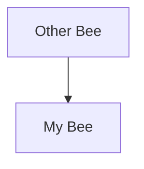

# Bees Ticket Management System — Product Requirements Document

**Version**: 1.0
**Date**: 2026-03-02
**Source Version**: v0.1.3
**Purpose**: Definitive specification for rebuilding the system from scratch. Every feature, behavior, data format, error type, and edge case is documented here. A reimplementation that passes the integration test suite (b.qi9) is considered functionally equivalent.

---

## Table of Contents

1. [System Overview](#1-system-overview)
2. [Core Concepts](#2-core-concepts)
3. [Ticket Data Model](#3-ticket-data-model)
4. [Ticket ID System](#4-ticket-id-system)
5. [File Format](#5-file-format)
6. [Configuration System](#6-configuration-system)
7. [Hive Management](#7-hive-management)
8. [Ticket CRUD Operations](#8-ticket-crud-operations)
9. [Relationship Management](#9-relationship-management)
10. [Tier System](#10-tier-system)
11. [Status Values System](#11-status-values-system)
12. [Query System](#12-query-system)
13. [Named Queries](#13-named-queries)
14. [Reference Materials System](#14-reference-materials-system)
15. [Index Generation](#15-index-generation)
16. [Undertaker (Archival)](#16-undertaker-archival)
17. [Move Bee](#17-move-bee)
18. [Clone Bee](#18-clone-bee)
19. [Linter / Sanitizer](#19-linter--sanitizer)
20. [Filesystem Watcher](#20-filesystem-watcher)
21. [Caching](#21-caching)
22. [CLI Interface](#22-cli-interface)
23. [MCP Server](#23-mcp-server)
24. [Sting / Hook System](#24-sting--hook-system)
25. [Error Type Reference](#25-error-type-reference)
26. [Integration Test Acceptance Criteria](#26-integration-test-acceptance-criteria)

---

## 1. System Overview

Bees is a **file-based ticket management system** designed for LLM-assisted development workflows. There is no database — all state lives on disk as Markdown files with YAML frontmatter. The system exposes all functionality through two interfaces:

- **CLI**: JSON output to stdout, exit codes for status
- **MCP Server**: FastMCP-based, supports stdio and HTTP transports

### 1.1 Design Constraints

- No database — Markdown files with YAML frontmatter only
- No daemons required (undertaker scheduling is optional, HTTP-mode only)
- Limited caching — mtime-based in-memory only; no persistent/distributed cache
- Scale target: tens of hives, thousands of tickets
- Max bees per scope: 39,304 (34³)
- Max children per parent: 1,156 (34²)

### 1.2 Design Principles

- **CLI/MCP parity**: Any capability exposed via CLI flags must have a corresponding MCP tool parameter, and vice versa. This ensures agents using MCP tools have the same capabilities as CLI users. The one permitted exception is stdin (`"-"`) support: CLI file flags accept `-` as a path to read from stdin, while MCP tool file parameters do not (stdin is not available in the MCP context).

### 1.3 Distribution

- Package name: `bees-md`
- CLI entry point: `bees`
- MCP server is an optional component (can be installed separately from the CLI)

---

## 2. Core Concepts

### 2.1 Hive

A hive is a registered directory that stores a group of related tickets. Hives are registered in a global config file (`~/.bees/config.json`) and belong to "scopes" (repo-path-keyed configuration groups). Each hive can have its own tier hierarchy, status constraints, and allowed resolvers.

### 2.2 Ticket

A ticket is a Markdown file with YAML frontmatter. The filename and containing directory share the same name as the ticket ID: `{ticket_id}/{ticket_id}.md`.

### 2.3 Scope

A scope is a path pattern in the config that maps a repository root (or set of repositories) to a configuration block containing hives, tier config, status values, and queries.

### 2.4 Cemetery

A special directory within each hive (`{hive_root}/cemetery/`) where archived tickets are stored. Cemetery contents are excluded from ALL normal operations — iteration, queries, linting, indexing.

---

## 3. Ticket Data Model

### 3.1 Fields

| Field | Type | Required | Default | Notes |
|-------|------|----------|---------|-------|
| `id` | string | Yes | generated | Must match filename and directory name |
| `type` | string | Yes | — | `"bee"` or tier ID (`"t1"`, `"t2"`, ... `"t9"`) |
| `title` | string | Yes | — | Non-empty; single-line (multiline triggers linter warning) |
| `status` | string \| null | No | null | Validated against hive's `status_values` if configured |
| `tags` | list[string] | No | [] | Empty list is omitted from file |
| `parent` | string \| null | No | null | Required for child tiers; forbidden for bees; **immutable after creation** |
| `children` | list[string] | No | [] | Auto-maintained bidirectionally; empty list omitted from file |
| `up_dependencies` | list[string] | No | [] | Tickets that block this one; same-type constraint |
| `down_dependencies` | list[string] | No | [] | Tickets this one blocks; auto-synced bidirectionally |
| `reference_materials` | list[dict] \| null | No | null | **Bee tickets only**; list of `{value, resolver?}` entries |
| `guid` | string | No | generated | 32-char; auto-generated at creation; **immutable** |
| `created_at` | string (ISO 8601) | No | generated | Set at creation time; **never modified on update** |
| `schema_version` | string | Yes | `"0.1"` | Auto-injected on write; presence validates file as a bees ticket |
| `description` | string | No | `""` | Stored as Markdown body (after closing `---`), NOT in frontmatter |

### 3.2 Allowed Frontmatter Fields

Only the fields listed in section 3.1 are permitted in ticket frontmatter: `id`, `type`, `title`, `status`, `tags`, `parent`, `children`, `up_dependencies`, `down_dependencies`, `reference_materials`, `guid`, `created_at`, `schema_version`. The `description` field is stored in the Markdown body (after the closing `---`), not in frontmatter. Any other field present in frontmatter is flagged as a linter error.

---

## 4. Ticket ID System

### 4.1 Character Set

34 characters, designed to avoid visual ambiguity:

```
ID_CHARSET = "123456789abcdefghijkmnopqrstuvwxyz"
```

**Excludes**: `0` (confusable with O), `l` (confusable with 1). The charset is all-lowercase plus digits 1-9, minus `l`.

### 4.2 ID Format by Tier

| Tier | Prefix | Short ID Length | Total Length | Example |
|------|--------|----------------|--------------|---------|
| bee (t0) | `b.` | 3 | 5 | `b.amx` |
| t1 | `t1.` | 3+2 = 5 | 8-9 | `t1.amx.1j` |
| t2 | `t2.` | 3+2+2 = 7 | 11-12 | `t2.amx.1j.4p` |
| tN | `tN.` | 3 + N×2 | varies | — |
| t9 (max) | `t9.` | 3+18 = 21 | varies | — |

### 4.3 ID Format Regex

```
^(b\.[1-9a-km-z]{3}|t(\d+)\.[1-9a-km-z]{3}(\.[1-9a-km-z]{2})+)$
```

### 4.4 Hierarchical ID Derivation

Child IDs encode their full ancestor chain. The bee's 3-char short ID appears in every descendant:

```
b.abc           → bee (root)
t1.abc.de       → child of b.abc
t2.abc.de.fg    → child of t1.abc.de
t3.abc.de.fg.hi → child of t2.abc.de.fg
```

The parent ID can be computed from any child ID purely by string manipulation — no filesystem scan needed:
- `b.abc` → parent is `None`
- `t1.abc.de` → parent is `b.abc`
- `t2.abc.de.fg` → parent is `t1.abc.de`

### 4.5 ID Generation

- **Bee**: 3 random characters from `ID_CHARSET`
- **Child**: parent's short ID + `.` + 2 random characters from `ID_CHARSET`
- **Uniqueness**: Bee IDs are unique across all hives in the scope. Child IDs are unique within their parent directory. After 2 collisions, a full exclusion set is built.

### 4.6 GUID

- Length: 32 characters
- Character set: same as `ID_CHARSET`
- Prefix: starts with the ticket's short ID (dots stripped from the full ID)
- Remainder: random characters from `ID_CHARSET` to fill to 32 chars
- Purpose: stable identifier for archived tickets (cemetery filenames)
- **Immutable** after creation

```
GUID_LENGTH = 32
```

### 4.7 ID Validation Errors

| Input | Error |
|-------|-------|
| `None` | `"ticket_id cannot be None"` |
| `""` | `"ticket_id cannot be empty"` |
| `"   "` (whitespace) | `"ticket_id cannot be empty"` |
| `"no-dot-format"` | `"Invalid ticket_id format…Expected format"` |
| `".empty-prefix"` | `"Both prefix and shortID required"` |
| `"b."` | `"Both prefix and shortID required"` |
| `"b.../../etc"` | `error_type: invalid_ticket_id` |

---

## 5. File Format

### 5.1 Ticket File Structure

```markdown
---
id: b.amx
type: bee
title: My Ticket Title
status: pupa
tags:
- backend
- api
up_dependencies:
- b.xyz
down_dependencies: []
reference_materials: null
guid: amx9f7k2r8p3m1n4q6t5v8wx2y3zab1c
created_at: '2026-01-15T10:30:00'
schema_version: '0.1'
---

Optional markdown body here. This becomes the `description` field.
```

### 5.2 Serialization Rules

| Type | Serialization |
|------|--------------|
| `int` | `key: 1` (unquoted) |
| `float` | `key: 2.5` (unquoted) |
| `None` | `key: null` |
| `True` | `key: true` |
| `False` | `key: false` |
| plain string | `key: Hello World` (unquoted) |
| YAML keyword string (`"true"`, `"null"`, `"yes"`, `"no"`, `"on"`, `"off"`) | `key: 'value'` (single-quoted) |
| string with `": "` | `key: 'Fix: the bug'` (single-quoted) |
| string starting with `[`, `{`, `#`, `&`, `*`, `!`, `>`, `"`, `'`, `@`, `` ` ``, `%`, `?`, `:`, `,` | single-quoted |
| string ending with `:` | single-quoted |
| string containing ` #` | single-quoted |
| string with leading/trailing whitespace | single-quoted |
| string that parses as float | single-quoted |
| string matching ISO 8601 timestamp prefix | single-quoted |
| empty string | `key: ''` |
| datetime | `key: '2024-06-15T10:30:00'` (single-quoted ISO) |
| empty list | **OMITTED entirely** from frontmatter |
| non-empty list | block style: `key:\n- item1\n- item2` |
| multi-line string (no trailing newline) | literal block `\|-` |
| multi-line string (with trailing newline) | literal block `\|` |
| nested dict | Falls back to standard YAML serialization |

### 5.3 Atomic Writes

All ticket file writes must be atomic — a reader must never see a partially-written file. The required approach:

1. Write content to a temporary file in the **same directory** as the target (ensuring same filesystem)
2. Atomically rename the temp file to the target path

On failure, the temp file must be cleaned up. The config file (`~/.bees/config.json`) uses the same pattern.

### 5.5 Schema Version

- Current: `"0.1"`
- Format: `x.y` or `x.y.z` (semver-like)
- Valid examples: `"0.1"`, `"1.0"`, `"1.0.0"`, `"2.1.3"`
- Invalid examples: `"v1.0.0"` (v-prefix), `"1.0.0-beta"` (prerelease), `"1"` (single segment)
- Linter severity: invalid schema_version = **error**

---

## 6. Configuration System

### 6.1 Global Config File

- **Location**: `~/.bees/config.json`
- **Config directory**: `~/.bees/`
- **Schema version**: `"2.0"`
- **No environment variables** — all config is file-based

### 6.2 Config Structure

```json
{
  "schema_version": "2.0",
  "scopes": {
    "/path/to/repo": {
      "hives": {
        "normalized_name": {
          "path": "/absolute/path/to/hive",
          "display_name": "Human Readable Name",
          "created_at": "2026-01-01T00:00:00",
          "child_tiers": {"t1": ["Task", "Tasks"], "t2": ["Subtask", "Subtasks"]},
          "status_values": ["larva", "pupa", "worker", "finished"],
          "allowed_resolvers": ["guid_resolver", "default"],
          "undertaker_schedule": {
            "interval_seconds": 3600,
            "query_yaml": "- ['status=finished']",
            "log_path": "/path/to/log"
          }
        }
      },
      "child_tiers": null,
      "status_values": null,
      "queries": {}
    }
  },
  "child_tiers": null,
  "status_values": null,
  "queries": {},
  "delete_with_dependencies": false,
  "auto_fix_dangling_refs": false,
  "mermaid_charts": true,
  "http": {"port": 8000}
}
```

### 6.3 Scope Pattern Matching

Scope keys are directory path patterns with optional wildcards:
- `*`: matches within one path segment (not `/`)
- `**`: matches recursively across path segments
- Exact path: matches only that directory

First matching scope wins (declaration order).

### 6.4 Three-Level Fallback Pattern

Used by `child_tiers`, `status_values`:

```
hive level → scope level → global level → hardcoded default
```

| Setting | `null`/absent | `{}` empty dict | `[]` empty list | Explicit value |
|---------|--------------|-----------------|-----------------|----------------|
| `child_tiers` | Fall through | **Stop chain** (bees-only) | N/A | Stop chain, use value |
| `status_values` | Fall through | N/A | **Fall through** (treated as unset) | Stop chain, use value |

### 6.5 Global-Only Config Flags

| Flag | Type | Default | Effect |
|------|------|---------|--------|
| `delete_with_dependencies` | bool | `false` | When deleting a ticket, also clean up dependency backlinks in surviving tickets |
| `auto_fix_dangling_refs` | bool | `false` | Linter auto-removes dangling references during sanitize |
| `mermaid_charts` | bool | `true` | Include mermaid dependency graphs in generated index.md |

### 6.6 Atomic Config Writes

Config file writes use the same atomic write pattern as ticket files (see section 5.3).

### 6.7 Test Config Mode

`--test-config` CLI flag: in-memory config, never touches `~/.bees/config.json`.

Accepts:
- Bare flag (empty config)
- Inline JSON string (`{...}`)
- File path to a config file

Mutually exclusive with `--config`. Ephemeral (discarded on exit).

### 6.8 Repo Root Resolution

- **CLI**: resolved to the current working directory (no git traversal required)
- **MCP**: via MCP roots protocol or explicit `repo_root` parameter

---

## 7. Hive Management

### 7.1 Hive Directory Structure

```
{hive_root}/
├── .hive/
│   └── identity.json        # Hive marker
├── cemetery/                 # Archived tickets (flat storage)
├── b.amx/                   # Bee directory
│   ├── b.amx.md             # Bee ticket
│   └── t1.amx.1j/           # Child tier directory
│       ├── t1.amx.1j.md
│       └── t2.amx.1j.4p/
│           └── t2.amx.1j.4p.md
├── b.xyz/
│   └── b.xyz.md
└── index.md                 # Auto-generated index
```

### 7.2 Hive Identity File

`.hive/identity.json`:
```json
{
  "normalized_name": "back_end",
  "display_name": "Back End",
  "created_at": "2026-01-01T00:00:00",
  "version": "1.0.0"
}
```

Does NOT contain `child_tiers` — that's config only.

### 7.3 Hive Name Normalization

Rules:
1. Lowercase
2. Spaces and hyphens → underscores
3. Remove non-alphanumeric/underscore characters
4. If starts with digit, prefix with `_`

| Display Name | Normalized |
|-------------|-----------|
| `"Back End"` | `"back_end"` |
| `"front-end"` | `"front_end"` |
| `"2024-proj"` | `"_2024_proj"` |
| `"UPPERCASE"` | `"uppercase"` |
| `"!!!"` | empty string → **error** |

### 7.4 colonize_hive

Creates a new hive:
1. Normalize the display name
2. Validate path is absolute and within repo root
3. Check for duplicate normalized name
4. Create `{path}/.hive/` directory
5. Write `.hive/identity.json`
6. Register in `~/.bees/config.json` under the matching scope
7. If no matching scope exists, create exact-path scope entry

Parameters: `name` (display name), `path` (absolute), optional `child_tiers`, `allowed_resolvers`

Returns: `{status: "success", normalized_name, display_name, path}`

Errors: `duplicate_name_error`, `filesystem_error`, `config_error`

### 7.5 list_hives

Returns all hives registered in the caller's scope.

Response:
```json
{
  "status": "success",
  "hives": [
    {"normalized_name": "back_end", "display_name": "Back End", "path": "/abs/path"}
  ]
}
```

Empty list when no config or no hives.

### 7.6 abandon_hive

Removes hive from config registry. Leaves all files on disk intact. Can be re-registered later with `colonize_hive`.

Error: `hive_not_found`

### 7.7 rename_hive

Updates the hive's display name, normalized name (config key), and optionally renames the directory on disk.

Parameters: `old_name`, `new_name`, `rename_folder` (default `true`)

Behavior:
- Updates config key from old normalized to new normalized
- Updates `display_name` in config
- Updates `.hive/identity.json`
- With `rename_folder=true`: physically moves directory on disk
- With `rename_folder=false`: only updates registry, no disk rename

Ticket IDs and cross-references are NOT updated.

Errors: `hive_not_found`, `name_conflict`, `validation_error` (normalizes to empty), `path_conflict` (target dir exists), `folder_rename_error`

### 7.8 Hive Path Validation

- Must be absolute path
- Must be within repo root (security constraint)
- Parent directories created if missing
- Trailing slashes normalized
- Symlinks resolved

### 7.9 Hive Discovery (scan_for_hive)

Searches recursively for `.hive/identity.json` matching a normalized name. Depth limit: 10 levels. Used as fallback when a registered hive path is stale.

---

## 8. Ticket CRUD Operations

### 8.1 Create Ticket

Parameters:
- `ticket_type` (required): `"bee"`, `"t1"`, `"t2"`, ..., or friendly name (`"Task"`, `"Subtask"`)
- `title` (required): non-empty string
- `hive_name` (required): display name or normalized name
- `description`: optional markdown body
- `parent`: required for child tiers; forbidden for bees
- `children`: optional list of child ticket IDs to link
- `up_dependencies`: optional list of blocking ticket IDs
- `down_dependencies`: optional list of dependent ticket IDs
- `tags`: optional list of strings
- `status`: optional; validated against `status_values` if configured
- `reference_materials`: optional; bee tickets only; list of `{value, resolver?}` dicts

Process:
1. Resolve `hive_name` (accepts display name or normalized name)
2. Validate `ticket_type` against hive's tier config (friendly names resolved to canonical)
3. If child tier: validate parent exists and is correct tier (t1 needs bee parent, t2 needs t1, etc.)
4. If `status_values` configured: validate status is in allowed list
5. Generate unique ticket ID
6. Generate GUID
7. Set `created_at` to current time
8. Set `schema_version` to current constant
9. Create ticket directory
10. Write ticket file (atomic)
11. Sync bidirectional relationships (parent↔children, deps↔deps)

Returns: `{status: "success", ticket_id, guid}`

Errors: `invalid_ticket_type`, `invalid_parent`, `invalid_status`, `invalid_dependency`, `circular_dependency`

### 8.2 Show Ticket

Parameters: `ticket_ids` (list of IDs)

Returns:
```json
{
  "status": "success",
  "tickets": [{...ticket fields including description...}],
  "not_found": ["b.zzz"],
  "errors": []
}
```

- Invalid ID format → goes to `errors` with `error_type: invalid_ticket_id`
- Valid ID but no ticket → goes to `not_found`
- Found ticket → fully populated in `tickets` array
- Reference materials are resolved per-entry using named resolvers (each entry augmented with a `resolved` key)

### 8.3 Update Ticket

Parameters:
- `ticket_id` (required): single ID or list of IDs
- `title`: new title (single mode only)
- `description`: new body text (single mode only)
- `status`: new status value (single and batch)
- `tags`: full replacement list (single mode only)
- `add_tags`: tags to add incrementally (single and batch)
- `remove_tags`: tags to remove incrementally (single and batch)
- `up_dependencies`: full replacement list (single mode only)
- `down_dependencies`: full replacement list (single mode only)
- `reference_materials`: new reference_materials value (single mode only, bee tickets only)
- `hive_name`: optional, speeds up ticket lookup by narrowing the search to one hive

**Batch mode**: when `ticket_id` is a list, only `status`, `add_tags`, `remove_tags` are allowed.

**Immutable fields**: `parent` and `children` cannot be set via update — attempting to pass these returns an error.

**Partial updates**: only specified fields change; unspecified fields preserved. `created_at` is never modified.

**Reference materials behavior**: unchanged when `reference_materials` parameter not passed; set to new value (including null) when passed.

Returns (single): `{status: "success", ticket_id}`
Returns (batch): `{status: "success", updated: [...]}`

Errors: `ticket_not_found`, `invalid_title` (empty), `invalid_dependency`, `circular_dependency`, `invalid_status`

### 8.4 Delete Ticket

Parameters: `ticket_ids` (list of IDs), optional `hive_name`

Behavior:
1. **Cascading delete**: deletes the entire subtree (all children recursively)
2. **Parent cleanup**: removes deleted ticket from parent's `children` array
3. **Dependency cleanup**: controlled by `delete_with_dependencies` global config flag
   - `false` (default): dependency backlinks in surviving tickets are left as dangling references
   - `true`: removes all dependency backlinks in surviving tickets before deletion

Returns: `{status: "success", deleted: [...], not_found: [...], failed: [...]}`

Bulk delete is resilient: IDs not found go to `not_found`, errors go to `failed`, remaining IDs continue processing.

---

## 9. Relationship Management

### 9.1 Bidirectional Consistency Principle

Every relationship is maintained bidirectionally. Both sides are updated atomically on every create/update.

### 9.2 Parent/Child Relationships

- Set at creation time via `parent` parameter
- **Immutable** after creation — cannot be changed via update
- When a child is created with `parent=X`:
  - Child's `parent` field is set to X
  - Parent X's `children` list gets child's ID added
- When a child is deleted:
  - Parent's `children` list gets child's ID removed

### 9.3 Dependency Relationships

- `up_dependencies`: tickets that must be resolved before this one (blockers)
- `down_dependencies`: tickets that this one must be resolved before (dependents)
- **Same-type constraint**: dependencies must be between tickets of the same type (bees→bees, t1→t1, etc.)
- **Cross-hive**: dependencies can cross hive boundaries
- **Bidirectional sync**: when ticket A adds `up_dependencies: [B]`, ticket B automatically gets `down_dependencies: [A]`

### 9.4 Circular Dependency Prevention

Cycle detection covers self-referencing (1-node), direct (2-node), and transitive (3+ node) cycles. All are rejected with `circular_dependency` error.

### 9.5 Tier Requirements

| Ticket Type | Required Parent Type |
|-------------|---------------------|
| bee | None (forbidden) |
| t1 | bee |
| t2 | t1 |
| t3 | t2 |
| tN | t(N-1) |

Error message: `"t1 ticket must have bee parent, got {parent_type}"`

---

## 10. Tier System

### 10.1 Configuration Format

```json
{
  "child_tiers": {
    "t1": ["Epic", "Epics"],
    "t2": ["Task", "Tasks"],
    "t3": ["Subtask", "Subtasks"]
  }
}
```

- Keys: `t1` through `t9` (maximum)
- Values: 2-element array `[singular, plural]` OR empty array `[]` for unnamed tier
- Sequence must be contiguous — no gaps (cannot have `t3` without `t1` and `t2`)
- Friendly names must be unique across all tiers (both singular and plural)
- `t10` and above are rejected (T9 cap)

### 10.2 Resolution Chain

`hive config` → `scope config` → `global config` → `bees-only {}`

- `null` / absent: fall through to next level
- `{}` (empty dict): **stop chain**, bees-only mode
- Populated dict: **stop chain**, use these tiers
- No merging between levels

### 10.3 Friendly Name Resolution

When creating tickets, both canonical names (`t1`, `t2`) and friendly names (`Task`, `Subtask`, `Epic`) are accepted. The response always uses the canonical tier name.

### 10.4 get_types

Returns tier configuration at all scope levels:

```json
{
  "status": "success",
  "global": null,
  "scope": null,
  "hives": {
    "hive_name": {"t1": ["Task", "Tasks"], "t2": ["Subtask", "Subtasks"]}
  }
}
```

- `{}` = bees-only explicitly set
- `null` = not set (inherits from parent level)

### 10.5 set_types

Parameters: `scope` (`"global"`, `"repo_scope"`, `"hive"`), optional `hive_name`, optional `child_tiers`, optional `unset`

Errors: `invalid_scope`, `missing_hive_name`, `invalid_child_tiers`, `missing_child_tiers`, `conflicting_params`, `hive_not_found`, `no_matching_scope`

Unset behavior:
- Global unset: removes `child_tiers` key entirely from config
- Hive unset: removes `child_tiers` key from hive entry (distinct from setting to null)
- Idempotent: unset when already absent → success

---

## 11. Status Values System

### 11.1 Behavior

- If no `status_values` configured anywhere in the fallback chain: any string accepted
- If configured: tickets must use one of the allowed values
- When `status_values` are configured and a ticket is created without `--status`: error (`"status is required"`)
- When no `status_values` configured and ticket created without `--status`: status is null

### 11.2 Resolution

`hive` → `scope` → `global` → `None` (freeform)

Special cases:
- `[]` (empty list) → treated as unset, falls through
- Explicit `null` at hive level → **stops chain**, disables inheritance (freeform for this hive)
- Duplicate values in list → deduplicated on write

### 11.3 set_status_values

Parameters: `scope` (`"global"`, `"repo_scope"`, `"hive"`), optional `hive_name`, optional `status_values` (list), optional `unset`

Errors: `invalid_scope`, `missing_hive_name`, `missing_status_values`, `conflicting_params`, `invalid_status_values` (empty string in list), `hive_not_found`, `no_matching_scope`

### 11.4 get_status_values

Returns raw values at each level (NOT merged/resolved):

```json
{
  "status": "success",
  "global": null,
  "scope": ["pupa", "worker"],
  "hives": {
    "hive_name": ["pupa", "worker", "finished"]
  }
}
```

Error: `no_matching_scope` when called from outside any registered repo

---

## 12. Query System

### 12.1 Query Format

Queries are YAML lists of stages. Each stage is a list of terms. Stages execute sequentially — results from stage N feed into stage N+1.

```yaml
- [type=bee, status=pupa]      # Stage 1: search
- [children]                    # Stage 2: graph traversal
- [status=worker]               # Stage 3: filter children
```

### 12.2 Search Terms

| Term | Description |
|------|-------------|
| `type=bee` | Exact match on ticket type |
| `type=t1` | Exact match on tier type |
| `id=b.abc` | Exact match on ticket ID |
| `status=pupa` | Exact match on status |
| `parent=b.abc` | Exact match on parent field |
| `guid=abc...` | Exact match on GUID |
| `hive=backend` | Exact match on hive normalized name |
| `title~regex` | Regex match on title (case-insensitive) |
| `tag~regex` | Regex match on any tag (case-insensitive) |
| `hive~regex` | Regex match on hive name (case-insensitive) |

### 12.3 Graph Traversal Terms

| Term | Description |
|------|-------------|
| `parent` | Get parent of each ticket in current result set |
| `children` | Get all children of each ticket in current result set |
| `up_dependencies` | Get upstream blockers of each ticket |
| `down_dependencies` | Get downstream dependents of each ticket |

### 12.4 Stage Rules

- All terms within a stage are **ANDed**
- A stage must be **pure**: either all search terms OR a single graph traversal term
- **Cannot mix** search and graph terms within a single stage
- Empty result at any stage **short-circuits** (returns empty immediately)

### 12.5 Pipeline Execution

1. Load ALL tickets from all hives into memory (fresh load, bypasses cache)
2. Apply hive filter (if `hive_names` specified)
3. Execute stages sequentially (search stages filter, graph stages traverse)
4. Short-circuit on empty results
5. Deduplicate results
6. Return list of full ticket objects

### 12.6 Regex Support

- Case-insensitive flags
- Alternation (`|`)
- Negative lookahead
- Character classes
- Anchors (`^`, `$`)

---

## 13. Named Queries

### 13.1 Storage

Named queries are stored in `~/.bees/config.json`:
- `scope="global"`: in top-level `"queries"` key
- `scope="repo"`: in `scopes[repo_path].queries`

The YAML string is parsed and validated at registration time; only the parsed stage list is persisted (not the original YAML string).

### 13.2 Resolution

When executing: repo scope checked first → global. If found in a different repo's scope → `query_out_of_scope`.

### 13.3 add_named_query

Conflict rules:
- `scope="global"`: checks ALL repo scopes + global for conflicts
- `scope="repo"`: checks caller's repo scope + global; other repos' scopes are NOT a conflict

Error: `query_name_conflict` (includes `conflict_level` and `conflict_location`)

### 13.4 delete_named_query

- Searches global first, then repo scopes
- After deleting last query from a scope: `"queries"` key removed entirely (not left as empty dict)
- Error: `query_not_found`

### 13.5 list_named_queries

Returns all accessible queries (repo scope + global).

### 13.6 execute_named_query / execute_freeform_query

Returns:
```json
{
  "status": "success",
  "tickets": [{...}],
  "stages_executed": 2
}
```

Errors: `query_not_found` (includes `available_queries` list), `query_out_of_scope`, `parse_error`

---

## 14. Reference Materials System

### 14.1 Reference Materials Field

- Only on **bee tickets** (child tiers must NOT have `reference_materials`)
- Type: list of dicts or null — each dict has a required `value` key and an optional `resolver` key
- Default: null
- Example: `[{"value": "src/main.py"}, {"value": "abc-guid", "resolver": "guid_resolver"}]`

### 14.2 Resolution

Resolution happens per-entry when `show_ticket` is called. Each entry's `resolver` key (defaulting to `"default"`) selects a resolver from the global named resolver registry.

**Default resolver** (built-in, no subprocess):
- Accepts a string file path (absolute or relative)
- Resolves relative paths against `repo_root`
- Returns `{"status": "success", "resolved_path": str}` on success
- Returns `{"status": "error", "raw_value": value, "error": str}` on failure

**Custom resolver invocation**:
```bash
/path/to/resolver.sh --repo-root /path/to/repo --value <value>
```

- String values: passed as raw text
- Non-string values: JSON-encoded before passing
- `null` values: short-circuit, returned as-is without subprocess call
- Output: valid JSON to stdout (any JSON value)
- Errors: to stderr
- Exit code 0 = success, non-zero = failure

**Timeout**: configured per resolver in the global `resolvers` registry via the `timeout` field.

**Response**: `show_ticket` returns each entry with an added `resolved` key containing the resolution result. Entries that fail resolution appear in the `errors` list in the response.

### 14.3 Named Resolver Registry

Resolvers are registered globally under the top-level `resolvers` key in `~/.bees/config.json`. See Named Resolver Registry in `docs/architecture/configuration.md` for full details.

Each hive may optionally restrict which resolvers are valid via the `allowed_resolvers` config key. Resolution fails with an error if the entry's resolver name is not in the hive's `allowed_resolvers` list.

---

## 15. Index Generation

### 15.1 Output

`{hive_root}/index.md` — overwritten on each generation.

### 15.2 Structure

```markdown
# Ticket Index

*Generated: 2026-01-15 10:30:00*



<details id="b-abc">
<summary>My Bee (b.abc) — pupa</summary>

<details>
<summary>Tasks</summary>

- [My Task](b.abc/t1.abc.de/t1.abc.de.md) [t1.abc.de] — worker

</details>
</details>

<details>
<summary>Tickets without parents</summary>
...
</details>
```

### 15.3 Mermaid Dependency Graph

- Nodes: bee-level tickets only
- Edges: `up_dependencies` between bees
- Node CSS classes map to status: `larva`, `pupa`, `worker`, `finished`, `failed`
- Click directives link to ticket files
- Only included if dependency edges exist
- Disabled globally via `mermaid_charts: false`
- Also generated per-parent for child-tier dependency edges

### 15.4 Ordering

Topological sort by `up_dependencies`. Ties broken by natural sort on title.

### 15.5 Rendering Rules

- Bee with children → `<details>` with `id` attribute
- Bee without children → `<div>` with plain markdown link
- Empty parents show tier-aware message (e.g. "*No epics*")
- Unparented tickets under separate "Unparented Tickets" section
- Zero tickets: only `# Ticket Index` header + timestamp
- Link format: `[title](relative-path) [ticket-id]` — hierarchical paths

### 15.6 Staleness Check

An index is stale when any ticket file's modification time is newer than the `index.md` file's modification time.

### 15.7 generate_index

Parameters: optional `hive_name`

- With `hive_name`: generates for that hive only
- Without: generates for ALL hives

Returns: `{status: "success", markdown, skipped_hives}`

---

## 16. Undertaker (Archival)

### 16.1 Manual Archival

Parameters: `hive_name` (required), exactly one of `query_yaml` or `query_name`

Process:
1. Execute query to get candidate tickets
2. Filter to bees only (non-bee tickets → `skipped` list)
3. **Phase 1 (atomic)**: move each bee's directory into the cemetery
4. **Phase 2 (best-effort rename)**: within cemetery, rename directories and files from `{shortID}` to `{guid}` format

Cemetery naming convention: `{tier}.{guid}.md` (flat, no subdirectories)

Returns: `{status, archived_count, archived_guids, skipped}`

Errors:
- Both `query_yaml` and `query_name` → error
- Neither → error
- `query_not_found`, `query_out_of_scope`

### 16.2 Scheduled Archival (HTTP Mode Only)

Per-hive configuration in `undertaker_schedule`:
```json
{
  "interval_seconds": 3600,
  "query_yaml": "- ['status=finished']",
  "query_name": null,
  "log_path": "/path/to/log"
}
```

- `interval_seconds`: required positive int
- `query_yaml` OR `query_name` required (not both)
- Background daemon thread
- After each successful run: regenerates index for the hive
- **Only active in HTTP mode** (not stdio, not CLI)

### 16.3 Archived Ticket Exclusion

Cemetery contents are excluded from all normal operations via positive-match traversal (the filesystem scanner only enters directories matching ticket ID patterns).

---

## 17. Move Bee

### 17.1 Parameters

- `bee_ids`: list of bee ticket IDs to move
- `destination_hive`: display name or normalized name
- `force`: boolean (default false)

### 17.2 Behavior

- Only bee tickets can be moved (non-bees → `failed`)
- Cemetery is never a valid destination
- Source and destination must be in the same scope
- Moves entire directory tree (including child subdirectories)
- Ticket ID in frontmatter is unchanged after move
- Already in destination → `skipped`
- Not found → `not_found`
- One failure doesn't stop batch

### 17.3 Compatibility Check

When `force=false` (default):
1. Scans ALL specified bees and their subtrees for statuses and tier types
2. Validates against destination hive's config:
   - Status check: source statuses must be subset of destination's `status_values` (if configured)
   - Tier check: source tier types must be configured in destination's `child_tiers` (if configured)
3. If ANY bee fails compatibility, ALL are aborted

`force=true` bypasses all compatibility checks.

### 17.4 Response

```json
{
  "status": "success",
  "moved": ["b.abc"],
  "skipped": ["b.def"],
  "not_found": ["b.zzz"],
  "failed": [{"id": "t1.abc.de", "reason": "Only bee tickets can be moved"}]
}
```

Errors: `hive_not_found`, `cemetery_destination`, `compatibility_error`

---

## 18. Clone Bee

### 18.1 Parameters

- `bee_id`: single bee ticket ID to clone
- `destination_hive`: optional (default: same hive)
- `force`: boolean (default false)

### 18.2 Behavior

- Only bee tickets (b. prefix) can be cloned
- Source and destination must be in the same scope
- Compatibility pre-check (unless `force=true`): same as move

Process:
1. Collect source tree in parent-before-children order
2. Generate new root bee ID
3. Generate new child IDs (preserving hierarchy)
4. Build ID remapping table (old → new)
5. For each ticket: remap `parent`, `children`, `up_dependencies`, `down_dependencies` to new IDs
6. Preserve external references (to tickets outside the subtree) unchanged
7. Copy: `title`, `status`, `tags`, `reference_materials` (root only), `description`
8. Generate new: `id`, `guid`, `created_at`, `schema_version`
9. Write each ticket file

Root bee write failure: fatal, entire operation fails
Child write failures: non-fatal, recorded in `failed` list

### 18.3 Response

```json
{
  "status": "success",
  "ticket_id": "b.xyz",
  "written": 3,
  "failed": []
}
```

Errors: `invalid_source_type` (non-bee ID), `bee_not_found`, `clone_write_error`, `compatibility_error`, `hive_not_found` (cross-scope)

---

## 19. Linter / Sanitizer

### 19.1 sanitize_hive

Runs the linter with `auto_fix=True` on all tickets in the specified hive.

Returns:
```json
{
  "status": "success",
  "is_corrupt": false,
  "fixes_applied": [
    {"ticket_id": "b.abc", "fix_type": "add_child", "description": "..."}
  ],
  "errors_remaining": [
    {"ticket_id": "b.abc", "error_type": "disallowed_field", "message": "...", "severity": "error"}
  ]
}
```

### 19.2 Linter Validation Rules

| Error Type | Severity | Auto-fixable | Description |
|------------|----------|-------------|-------------|
| `invalid_id` | error | No | ID format doesn't match regex |
| `path_id_mismatch` | error | No | Directory/filename doesn't match ticket ID |
| `duplicate_id` | error | No | Same ID in multiple files (marks report corrupt) |
| `multiline_title` | warning | No | Title contains `\n` or `\r` |
| `invalid_schema_version` | error | No | Not valid semver |
| `missing_date` | warning | No | `created_at` null or missing |
| `invalid_date_format` | warning | No | `created_at` not parseable ISO 8601 |
| `missing_guid` | warning | Yes (generates) | No GUID field |
| `invalid_guid_length` | warning | Yes (regenerates) | Not 32 chars |
| `invalid_guid_charset` | warning | Yes (regenerates) | Invalid chars |
| `invalid_guid_prefix` | warning | Yes (regenerates) | Doesn't start with short_id |
| `disallowed_field` | error | No | `owner`, `priority`, etc. in frontmatter |
| `invalid_field_type` | error | No | Status not string; `reference_materials` invalid format |
| `invalid_status` | error | No | Status not in configured `status_values` |
| `unknown_tier` | error | No | Undefined tier type for hive |
| `invalid_tier_parent` | error | No | Parent is wrong tier for child |
| `orphaned_ticket` | error | Yes (set parent) | Child references missing parent |
| `dangling_parent` | error | Conditional* | Parent not found in any hive |
| `invalid_parent_id` | error | No | Parent field has invalid format |
| `invalid_child_id` | error | No | Child ID format invalid |
| `invalid_child_type` | error | No | Child type doesn't match tier expectations |
| `invalid_dependency_id` | error | No | Dependency ID format invalid |
| `cross_type_dependency` | error | No | Dependency between different ticket types |
| `dangling_dependency` | warning | Conditional* | Dependency not found in any hive |
| `orphaned_dependency` | error | Yes | Upstream missing down_dep backlink |
| `missing_backlink` | error | Yes | Downstream missing up_dep backlink |
| `dependency_cycle` | error | No | Circular dependency chain |
| `hierarchy_cycle` | error | No | Circular parent-child chain |
| `hive_load_failure` | — | No | Failed to load a hive; skips dangling checks |

*Conditional: `dangling_dependency` and `dangling_parent` are auto-fixed only when `auto_fix_dangling_refs: true` in global config.

### 19.3 Auto-Fix Categories

1. **Directory structure enforcement** (always enabled): moves misplaced ticket directories to correct location based on frontmatter `parent` field
2. **Bidirectional field repair** (when `auto_fix=True`): `add_child`, `set_parent`, `add_down_dependency`, `add_up_dependency`
3. **Dangling reference removal** (when `auto_fix_dangling_refs: true`): `remove_dangling_dependency`, `clear_dangling_parent`

### 19.4 Source of Truth

Frontmatter (`parent`, `children`) is authoritative; filesystem structure is derived. The linter auto-corrects filesystem misplacements based on frontmatter.

---

## 20. Filesystem Watcher

### 20.1 Behavior

- Watches all configured hive directories recursively
- Triggers on `.md` file changes (not `index.md`, not directories)
- 2-second debounce (configurable)
- On trigger: runs linter with `auto_fix=True` on all hives → regenerates all indexes
- Rapid changes cancel and reschedule (only one active timer at a time)
- Thread-safe

### 20.2 Activation

- `bees serve --watch` (CLI)
- Always runs in HTTP mode
- Not available in stdio mode

### 20.3 Error Handling

- Errors logged; state cleaned
- Per-hive isolation: one hive failure doesn't stop others
- Nonexistent hive paths silently skipped

Error: `"No hives configured"` if no hives in config

---

## 21. Caching

### 21.1 Overview

The system maintains an in-memory cache of parsed tickets, keyed by ticket ID. Each cache entry stores the file's modification time, path, and parsed ticket data.

### 21.2 Cache Behavior

- **Read**: if the file's mtime hasn't changed since caching, return the cached ticket; otherwise re-read and re-parse
- **Write**: evict the cache entry after a successful write (never populate cache during writes)
- **Delete**: evict the cache entry after deletion
- **Move**: evict the cache entry after a ticket is moved

### 21.3 Lifecycle

- Empty on startup (no pre-warming)
- Lazy-populated on first read of each ticket
- No size-based eviction: entries retained for lifetime of the server process
- Query pipeline loads all tickets fresh (bypasses cache) to ensure consistency

---

## 22. CLI Interface

### 22.1 General Behavior

- All output: JSON to stdout
- Exit codes: 0 = success, 1 = error, 2 = usage/argument error
- Errors are JSON to stdout (never to stderr, never tracebacks)
- All commands resolve repo root from CWD
- Global flags: `--config <path>`, `--test-config [<json|path>]`

### 22.2 Error Response Format

```json
{"status": "error", "error_type": "snake_case_string", "message": "Human readable"}
```

### 22.3 Complete Command List

| Command | Key Arguments |
|---------|--------------|
| `create-ticket` | `--ticket-type --title --hive [--body \| --body-file --parent --children --up-deps --down-deps --tags --status --reference-materials]` |
| `show-ticket` | `ID [ID ...]` |
| `update-ticket` | `--ids ID [ID ...] [--title --body \| --body-file --status --tags --up-deps --down-deps --reference-materials --add-tags --remove-tags --hive]` |
| `append-ticket-body` | `--ticket-id (--chunk \| --chunk-file) [--hive]` |
| `delete-ticket` | `ID [ID ...] [--hive]` |
| `get-types` | (none) |
| `set-types` | `--scope [--hive] [--child-tiers JSON] [--unset]` |
| `get-status-values` | (none) |
| `set-status-values` | `--scope [--hive] [--values JSON] [--unset]` |
| `add-named-query` | `--query-name --query-yaml [--scope global\|repo]` |
| `execute-named-query` | `--query-name` |
| `execute-freeform-query` | `--query-yaml` |
| `list-named-queries` | (none) |
| `delete-named-query` | `--query-name` |
| `colonize-hive` | `--name --path [--child-tiers JSON] [--allowed-resolvers JSON]` |
| `list-hives` | (none) |
| `abandon-hive` | `--hive` |
| `rename-hive` | `--old-name --new-name [--no-rename-folder]` |
| `sanitize-hive` | `--hive` |
| `generate-index` | `[--hive]` |
| `undertaker` | `--hive [--query-yaml \| --query-name]` |
| `move-bee` | `--hive DEST ID [ID ...] [--force]` |
| `clone-bee` | `ID [--hive DEST] [--force]` |
| `serve` | `[--stdio \| --http] [--host] [--port] [--config] [--test-config] [--watch]` |
| `sting` | (none) |
| `setup claude cli` | `[--project] [--remove]` |

### 22.4 JSON Argument Passing

List and dict arguments are passed as JSON strings on the command line:
```bash
bees create-ticket --ticket-type bee --title "My Bee" --hive "Test Hive" \
  --tags '["urgent","backend"]' --reference-materials '[{"value":"src/main.py"}]'
```

---

## 23. MCP Server

### 23.1 Server Details

- Server name: `"bees"`
- Protocol: MCP (Model Context Protocol)
- Transports: stdio (default) or HTTP
- HTTP default: `127.0.0.1:8000` (configurable via `http.port` in config or `--port` flag)
- All tools accept optional `repo_root` parameter
- MCP server dependencies should not be required for CLI-only usage

### 23.2 Repo Root Resolution (MCP)

The MCP server needs to know which repository the caller is working in, so it can find the right scope and hives.

1. **Roots-enabled clients** (e.g., Claude Desktop, Claude Code, OpenCode): The client automatically sends its working directory via the MCP Roots Protocol. The server reads the first root URI, strips the `file://` prefix, and uses that as the repo root. No `repo_root` parameter is needed.
2. **Basic MCP clients** (no Roots Protocol support): The caller must pass `repo_root` explicitly on every tool call. If omitted, the server returns an error instructing the client to supply `repo_root`.

### 23.3 Complete MCP Tool List

| MCP Tool | CLI Equivalent | Notes |
|----------|---------------|-------|
| `health_check` | — | Returns `{status: "ok"}` |
| `create_ticket` | `create-ticket` | |
| `update_ticket` | `update-ticket` | Optional string fields use a sentinel value to distinguish "not provided" from "set to null" |
| `delete_ticket` | `delete-ticket` | Accepts single ID or list |
| `show_ticket` | `show-ticket` | Returns `{tickets, not_found, errors}` |
| `get_types` | `get-types` | |
| `set_types` | `set-types` | |
| `get_status_values` | `get-status-values` | |
| `set_status_values` | `set-status-values` | |
| `colonize_hive` | `colonize-hive` | |
| `list_hives` | `list-hives` | |
| `abandon_hive` | `abandon-hive` | |
| `rename_hive` | `rename-hive` | |
| `sanitize_hive` | `sanitize-hive` | |
| `add_named_query` | `add-named-query` | |
| `execute_named_query` | `execute-named-query` | |
| `execute_freeform_query` | `execute-freeform-query` | |
| `delete_named_query` | `delete-named-query` | |
| `list_named_queries` | `list-named-queries` | |
| `generate_index` | `generate-index` | Returns `{status, markdown, skipped_hives}` |
| `undertaker` | `undertaker` | |
| `move_bee` | `move-bee` | `force: bool = False` |
| `clone_bee` | `clone-bee` | `hive: str|None`, `force: bool = False` |

### 23.4 HTTP-Specific Features

- Health check endpoint: `GET /health`
- Undertaker scheduler (background thread)
- Filesystem watcher (auto-linting and index regeneration)
- Port: defaults to `config["http"]["port"]` or 8000; `--port` flag overrides

### 23.5 Stdio-Specific Behavior

- All logs redirected to `~/.bees/mcp.log` (stdout reserved for JSON-RPC)
- No undertaker scheduling
- No filesystem watcher
- `--config` flag for custom config path

---

## 24. Sting / Hook System

### 24.1 Sting Command

`bees sting` — intended to run as a Claude hook (SessionStart, PreCompact).

Logic:
1. Check if CWD is in a bees-managed scope → if not, exit 0 silently
2. Scan Claude config locations for bees MCP server entry → if found, exit 0 silently
3. If no MCP detected: print CLI reference to stdout and exit 0

MCP entry detection regex: `(?i)(?:^|[-_])bees(?:$|[-_])` (matches `bees`, `bees-mcp` but not `frisbees`)

Claude config scan locations:
- `~/.claude.json` (global `mcpServers` + per-project)
- `<repo>/.mcp.json`
- `~/.claude/settings.json`
- `<repo>/.claude/settings.local.json`

### 24.2 Setup Claude CLI

`bees setup claude cli [--project] [--remove]`

Installs hook entries:
```json
{
  "hooks": {
    "SessionStart": [{"hooks": [{"type": "command", "command": "bees sting"}]}],
    "PreCompact": [{"hooks": [{"type": "command", "command": "bees sting"}]}]
  }
}
```

- Default target: `~/.claude/settings.json`
- With `--project`: `<cwd>/.claude/settings.local.json`
- `--remove`: removes the hooks; **idempotent** (removing when not present → success)
- Re-running install when already present → success, no duplicates

---

## 25. Error Type Reference

### 25.1 Ticket Operations

| Error Type | When |
|------------|------|
| `ticket_not_found` | Ticket ID doesn't exist |
| `invalid_ticket_type` | Type not configured for hive |
| `invalid_ticket_id` | ID format doesn't match regex or path traversal attempt |
| `invalid_title` | Empty or whitespace-only title |
| `invalid_dependency` | Dependency ticket doesn't exist |
| `circular_dependency` | Adding dep would create a cycle |
| `invalid_parent` | Parent wrong type or doesn't exist |
| `invalid_status` | Status not in configured `status_values` |
| `invalid_source_type` | Clone non-bee ID |
| `bee_not_found` | Clone target doesn't exist |
| `clone_write_error` | Root bee write failed during clone |
| `compatibility_error` | Move/clone to incompatible hive |

### 25.2 Hive Operations

| Error Type | When |
|------------|------|
| `hive_not_found` | Hive name not registered |
| `duplicate_name_error` | Colonize duplicate name |
| `name_conflict` | Rename to existing name |
| `validation_error` | Name normalizes to empty |
| `path_conflict` | Rename target directory exists |
| `folder_rename_error` | OS error during rename |
| `filesystem_error` | identity.json write failure |
| `config_error` | Config save failure |
| `cemetery_destination` | Move to cemetery |
| `list_hives_error` | Error listing hives |

### 25.3 Query Operations

| Error Type | When |
|------------|------|
| `query_not_found` | Named query doesn't exist (includes `available_queries`) |
| `query_out_of_scope` | Query exists in different repo's scope |
| `query_name_conflict` | Name already exists (includes `conflict_level`, `conflict_location`) |
| `invalid_scope` | Scope not `global`, `repo_scope`, or `repo` |
| `scope_not_found` | No matching scope for repo |
| `invalid_query` | Empty query name |
| `parse_error` | Invalid YAML or query structure |

### 25.4 Config Operations

| Error Type | When |
|------------|------|
| `missing_hive_name` | Hive scope without hive name |
| `missing_status_values` | No values and not unset |
| `missing_child_tiers` | No tiers and not unset |
| `conflicting_params` | Both value and unset=true |
| `invalid_status_values` | Empty string in values list |
| `invalid_child_tiers` | Invalid format |
| `no_matching_scope` | No scope matches repo |

### 25.5 Reference Materials Operations

| Error Type | When |
|------------|------|
| `missing_config` | Custom resolver without `resolved_root` |

---

## 26. Integration Test Acceptance Criteria

The integration test suite lives at `b.qi9` in the testplans hive. It consists of 5 phases and ~147 test cases across 26+ test areas. A reimplementation is considered functionally equivalent if it passes all these tests.

### 26.1 Phase Structure

| Phase | ID | Tests | Description |
|-------|-----|-------|-------------|
| 1 | t1.qi9.8h | 1-3 | Installation & Environment |
| 2 | t1.qi9.w8 | 4-77 | CLI Exhaustive Tests (Part 1) |
| 3 | t1.qi9.de | 104-114 | Stdio MCP Server Tests |
| 4 | t1.qi9.4u | 115-126 | HTTP MCP Server Tests |
| 5 | t1.qi9.h5 | 78-147 | CLI Exhaustive Tests (Part 2) |

### 26.2 Test Areas Summary

| # | Area | Key Features Tested |
|---|------|-------------------|
| 1 | Hive Management | colonize, list, rename (with/without folder), duplicate rejection |
| 2 | Tier Configuration | get/set/unset at global/repo/hive; inheritance |
| 3 | Ticket CRUD | create, show (single/bulk), update (all fields), delete (single/bulk/cascade), hierarchy sync, immutable parent, add_tags/remove_tags |
| 4 | Dependencies | up/down deps, bidirectional sync, delete_with_dependencies, default dangling |
| 5 | ID and GUID Validation | ID format per tier, charset exclusion, path traversal rejection, GUID format |
| 6 | Status Behavior | freeform default, sanitizer linting invalid status |
| 7 | Freeform Queries | filter by type/status/title/tag/hive, graph traversal |
| 8 | Named Queries | add (global/repo), execute, list, conflict rejection, delete |
| 9 | Reference Materials | reference_materials entries, custom resolver, per-entry resolution |
| 10 | Index Generation | all hives and specific hive |
| 11 | Undertaker | archive via YAML/named query, cemetery naming, exclusion |
| 12 | Move Bee | cross-hive, ID preserved, reject non-bee, skip-at-dest, compatibility, --force |
| 13 | Sanitizer | clean hive ok, auto-fix bidirectional, disallowed fields, dangling, auto_fix_dangling_refs |
| 14 | Error Handling | all errors as clean JSON (no tracebacks), correct error_types |
| 15 | Test Config Mode | ephemeral empty, inline JSON, file-based, never writes real config |
| 16 | Setup Command | install/remove sting hooks, global and project, idempotent |
| 17 | Sting Command | silent in MCP-detected mode, clean exit outside scope |
| 18 | Status Values | set/unset at all scopes, get mixed config, required/invalid validation |
| 19 | http.port Config | reads from config, --port overrides |
| 20 | list-named-queries | Bug fix regression |
| 21 | T9 Cap | t10+ rejected with clear error |
| 22 | ID Format Validation | excluded chars rejected, length per tier |
| 23 | ID Charset / Hierarchy | 3-level hierarchy, bidirectional parent/children, ID lengths |
| 24 | Fast Parser | search filters and graph traversals return correct results |
| 25 | Clone Bee | flat/tree clone, remapped refs, non-bee rejection, cross-hive, compatibility, --force |
| 26 | Uninstall | remove hooks, pipx uninstall |

### 26.3 Cross-Cutting Test Requirements

Every integration test expects:
1. **Exit code 0 for success, 1 for errors, 2 for usage**
2. **JSON output to stdout** — never tracebacks, never errors to stderr
3. **Clean error format**: `{status: "error", error_type: "...", message: "..."}`
4. **Bidirectional consistency**: every relationship sync verified from both sides
5. **No side effects on failure**: failed operations leave system state unchanged
6. **Idempotent operations**: where stated (remove hooks, abandon absent hive is exception)

---

## Appendix A: File Paths

| Path | Purpose |
|------|---------|
| `~/.bees/config.json` | Global config |
| `~/.bees/mcp.log` | MCP server log (stdio mode) |
| `~/.bees/server.log` | HTTP server log |
| `{hive_root}/.hive/identity.json` | Hive marker |
| `{hive_root}/{id}/{id}.md` | Ticket file |
| `{hive_root}/cemetery/` | Archived tickets |
| `{hive_root}/index.md` | Generated index |
| `{ticket_dir}/.{id}_{random}.md.tmp` | Temp file during atomic write |
| `{bees_dir}/.config.json.{random}` | Temp file during config write |

## Appendix B: Constants

```
SCHEMA_VERSION = "0.1"
ID_CHARSET = "123456789abcdefghijkmnopqrstuvwxyz"  # 34 chars
GUID_LENGTH = 32
BEES_CONFIG_DIR = ".bees"
BEES_CONFIG_FILENAME = "config.json"
GLOBAL_SCHEMA_VERSION = "2.0"
```

## Appendix C: Excluded Directories During Traversal

The ticket filesystem scanner only enters directories matching ticket ID patterns. This implicitly excludes:
- `cemetery/`
- `.hive/`
- `evicted/`
- Any other non-ticket-ID directory

## Appendix D: Recommended Status Values

The project uses these statuses by convention (not enforced unless `status_values` configured):
- `larva`: Not completely documented. Not ready to work.
- `pupa`: Completely documented. Ready to work.
- `worker`: Work in progress.
- `finished`: Work completed.

## Appendix E: MCP Tool Descriptions

These are the descriptions exposed to MCP clients for each tool.

### `health_check`
Check the health status of the MCP server.

### `create_ticket`
Create a new ticket in a hive.

Args:
- `ticket_type`: Tier type — "bee" (top-level) or a child tier by ID ("t1", "t2") or friendly name ("Task", "Epic"). Use get_types to see configured tiers.
- `title`: Short title for the ticket.
- `hive_name`: Hive to create the ticket in. Use list_hives to see available hives.
- `description`: Optional markdown body.
- `parent`: Parent ticket ID. Required for child-tier tickets; omit for bees. The parent ticket's children field is updated automatically.
- `children`: Child ticket IDs to link at creation time. Bidirectional relationship is updated automatically — the child tickets' parent field will be set.
- `up_dependencies`: Ticket IDs that must be resolved before this one.
- `down_dependencies`: Ticket IDs that this one must be resolved before.
- `tags`: List of string tags.
- `status`: Freeform if no status_values are configured for the hive; otherwise must be one of the hive's configured values. Required when status_values are configured.
- `reference_materials`: Tracks external resources related to the ticket. A list of `{value, resolver?}` dicts. Only supported on bee (t0) tickets.

### `update_ticket`
Update one or more existing tickets.

Supports single update (ticket_id as str) or batch update (ticket_id as list[str]). Batch mode only allows status, add_tags, and remove_tags — other fields are rejected.

Args:
- `ticket_id`: Ticket ID to update, or list of IDs for batch update.
- `title`: New title (single mode only).
- `description`: New markdown body (single mode only).
- `up_dependencies`: Full replacement list of blocking ticket IDs (single mode only).
- `down_dependencies`: Full replacement list of dependent ticket IDs (single mode only).
- `tags`: Full replacement list of tags (single mode only).
- `add_tags`: Tags to add (single and batch).
- `remove_tags`: Tags to remove (single and batch).
- `status`: New status value (single and batch).
- `reference_materials`: New reference materials data (single mode only). Only supported on bee tickets.
- `hive_name`: Optional hive name for faster lookup.

### `delete_ticket`
Delete one or more tickets and their child subtrees.

Supports single delete (ticket_ids as str) or bulk delete (ticket_ids as list[str]). Deletion cascades — all child tickets are deleted along with the root.

Dependency cleanup is controlled by the global config key `delete_with_dependencies` (boolean, default False).

Args:
- `ticket_ids`: Ticket ID to delete, or list of IDs for bulk delete.
- `hive_name`: Optional hive name for faster lookup.

### `show_ticket`
Retrieve one or more tickets by ID.

Args:
- `ticket_ids`: List of ticket IDs to retrieve (e.g., ["b.Amx", "b.Xyz"]).

### `get_types`
Shows allowed ticket types for all available hives.

### `set_types`
Set or unset the ticket tier configuration at a given scope.

Configures the tier hierarchy (e.g., t1 → t2 → t3) at global, repo_scope, or hive level.

Args:
- `scope`: Target scope — "global", "repo_scope", or "hive".
- `hive_name`: Required when scope="hive".
- `child_tiers`: Dict mapping tier keys to [singular, plural] names. e.g. {"t1": ["t1", "t1s"], "t2": ["t2", "t2s"]}. Pass {} for bees-only (no child tiers). Required unless unset=True.
- `unset`: If True, removes child_tiers from the target scope.

### `get_status_values`
Get the configured status values at all scope levels (global, repo_scope, and per-hive).

Shows what is explicitly set at each level. Levels with nothing defined inherit from upper levels.

### `set_status_values`
Set or unset the allowed status values at a given scope.

Configures which status strings are valid for tickets at global, repo_scope, or hive level. If no status_values are configured, any string is accepted.

Args:
- `scope`: Target scope — "global", "repo_scope", or "hive".
- `hive_name`: Required when scope="hive".
- `status_values`: List of allowed status strings (e.g., ["open", "in_progress", "closed"]). Required unless unset=True.
- `unset`: If True, removes status_values from the target scope.

### `colonize_hive`
Create and register a new hive. A hive is a directory where a group of related tickets are stored.

Always ask the user for the hive name and path if not explicitly provided.

Args:
- `name`: Display name for the hive (e.g., "Back End"). Normalized internally.
- `path`: Absolute path where the hive will be created. Does not need to exist.
- `child_tiers`: Optional per-hive tier config. Inherits from scope/global if omitted. Pass {} for bees-only.
- `allowed_resolvers`: Optional list of resolver names permitted for this hive (e.g., `["guid_resolver", "default"]`).

### `list_hives`
List all available hives.

### `abandon_hive`
Stop tracking a hive without deleting its ticket files.

Removes the hive from the registry but leaves all files intact on disk. The hive can be re-registered later with colonize_hive.

Args:
- `hive_name`: Display name or normalized name of the hive to abandon.

### `rename_hive`
Rename a hive and optionally its folder on disk. Ticket IDs are not affected.

Args:
- `old_name`: Current hive name.
- `new_name`: New hive name.
- `rename_folder`: If True (default), also renames the folder on disk to match the new normalized hive name.

### `sanitize_hive`
Validate and auto-fix malformed tickets in a hive.

Returns a list of errors it cannot fix automatically — these will need to be resolved by you or the user.

Args:
- `hive_name`: Display name or normalized name of the hive to sanitize.

### `add_named_query`
Register a named query for reuse. See execute_freeform_query for query syntax.

Args:
- `name`: Name for the query (used to execute it later).
- `query_yaml`: YAML string representing the query pipeline.
- `scope`: Where to store the query — "global" (all repos) or "repo" (current repo only). Defaults to "global".

### `execute_named_query`
Execute a registered named query.

Args:
- `query_name`: Name of the query to execute.

### `execute_freeform_query`
Execute a YAML query pipeline.

Each stage is a list of terms. Stages execute sequentially — results from stage N are passed into stage N+1 as the working set to filter or traverse.

Search stages — filter tickets (AND logic within stage):
- `type=bee | type=t1 | type=t2 ...` — exact match on ticket type
- `status=<value>` — exact match on status
- `title~<regex>` — regex match on title
- `tag~<regex>` — regex match on any tag
- `id=<ticket_id>` — exact match on ticket ID
- `parent=<ticket_id>` — exact match on parent
- `guid=<guid>` — exact match on GUID
- `hive=<name>` — exact match on hive name
- `hive~<regex>` — regex match on hive name

Graph stages — traverse relationships from current result set:
- `parent` — get parent of each ticket
- `children` — get children of each ticket
- `up_dependencies` — get upstream blockers of each ticket
- `down_dependencies` — get downstream dependents of each ticket

Args:
- `query_yaml`: YAML string — a list of stages, each stage a list of terms. Example: `"- [type=bee, status=open]\n- [children]"`

### `delete_named_query`
Delete a named query by name. Searches all scopes (global first, then repo).

Args:
- `name`: Name of the query to delete.

### `list_named_queries`
List named queries accessible from the current repo scope and global.

### `generate_index`
Generate index.md pages for hives.

Args:
- `hive_name`: Optional hive name. If omitted, generates for all hives.

### `undertaker`
Archive bee tickets matching a query into the hive's /cemetery directory.

Args:
- `hive_name`: Hive to operate on (required).
- `query_yaml`: YAML string for freeform query (mutually exclusive with query_name).
- `query_name`: Name of a registered query (mutually exclusive with query_yaml).

To schedule automatic archiving, add an `undertaker_schedule` block to the hive in `~/.bees/config.json`:
```json
{
  "undertaker_schedule": {
    "interval_seconds": 60,
    "query_yaml": "- ['status=finished']"
  }
}
```

### `move_bee`
Move bee tickets to a different hive.

Only bee tickets (b. prefix) can be moved. Cemetery is never a valid destination — use undertaker instead.

Args:
- `bee_ids`: Bee ticket IDs to move (e.g., ["b.Amx", "b.X4F"]).
- `destination_hive`: Friendly or normalized name of the destination hive (e.g., "Back End" or "back_end").
- `force`: When True, skip cross-hive compatibility checks.

### `clone_bee`
Clone a bee ticket and its entire subtree within the same hive.

Creates a deep copy with fresh IDs and GUIDs. Internal cross-references (parent, children, dependencies) are remapped to the new IDs. External references are preserved unchanged.

Args:
- `bee_id`: The bee ticket ID to clone (e.g., "b.Amx"). Must be a bee ticket (b. prefix).

Returns: `{"status": "success", "ticket_id": "<new-bee-id>", "written": N, "failed": [...]}`

## Appendix F: CLI Help Text

### `bees` (top-level)

```
usage: bees [-h] {create-ticket,show-ticket,update-ticket,delete-ticket,
            get-types,set-types,set-status-values,get-status-values,
            add-named-query,execute-named-query,execute-freeform-query,
            delete-named-query,list-named-queries,colonize-hive,list-hives,
            abandon-hive,rename-hive,sanitize-hive,generate-index,move-bee,
            clone,undertaker,sting,setup,serve} ...

Bees ticket management CLI. All commands output JSON to stdout, including
errors. Exit 0 on success, exit 1 on error.

commands:
    create-ticket       Create a new ticket
    show-ticket         Retrieve one or more tickets
    update-ticket       Update an existing ticket
    delete-ticket       Delete one or more tickets
    get-types           Show configured child tiers for all hives
    set-types           Set or unset child tier configuration
    set-status-values   Set or unset allowed status values
    get-status-values   Show configured status values at all scope levels
    add-named-query     Register a named query
    execute-named-query Execute a registered named query
    execute-freeform-query Execute an ad-hoc YAML query
    delete-named-query  Delete a named query
    list-named-queries  List all saved named queries accessible from this repo
    colonize-hive       Create and register a new hive
    list-hives          List all registered hives
    abandon-hive        Stop tracking a hive without deleting files
    rename-hive         Rename a hive
    sanitize-hive       Validate and auto-fix malformed tickets in a hive
    generate-index      Generate markdown index of tickets
    move-bee            Move bee tickets to a different hive
    clone               Clone a bee and its entire subtree with fresh IDs
    undertaker          Archive bee tickets matching a query
    sting               Output bees context for Claude Code sessions
    setup               Configure integrations
    serve               Start the MCP server
```

### `bees append-ticket-body`

```
usage: bees append-ticket-body --ticket-id ID (--chunk TEXT | --chunk-file PATH)
                               [--hive NAME]

Append a chunk to an existing ticket's body. Each call concatenates --chunk onto
the end of the existing body with no separator. Use this whenever the full body
would exceed 10000 characters on create-ticket / update-ticket: create the ticket
with the first 10000-character chunk, then call append-ticket-body repeatedly
with subsequent chunks of up to 10000 characters each. Empty chunks are accepted
as no-ops.

  --ticket-id ID        ID of the existing ticket whose body will be appended to
                        (e.g. b.amx, t1.nha).
  --chunk TEXT          Text to append to the ticket body (required: one of
                        --chunk or --chunk-file). Must be 10000 characters or
                        fewer; pass an empty string for a no-op.
  --chunk-file PATH     Read the chunk text from a UTF-8 file (use '-' for
                        stdin); same 10000-character per-chunk cap as --chunk.
  --hive NAME           Hive name for O(1) ticket lookup (optional).
```

Note: `--chunk` and `--chunk-file` are mutually exclusive (exactly one is required); pass `--chunk-file -` to read the chunk from stdin.

### `bees create-ticket`

```
usage: bees create-ticket --ticket-type TYPE --title TITLE --hive HIVE
                          [--body BODY | --body-file PATH] [--parent ID]
                          [--children JSON] [--up-deps JSON] [--down-deps JSON]
                          [--tags JSON] [--status STATUS] [--reference-materials JSON]

  --ticket-type TYPE    "bee" for top-level, or child tier by ID ("t1", "t2")
                        or friendly name. Run get-types to see configured tiers.
  --title TITLE         Ticket title
  --hive HIVE           Hive to create the ticket in
  --body BODY           Ticket body (markdown). Capped at 10000 characters; for
                        larger bodies, create the ticket with the first
                        10000-character chunk and use 'bees append-ticket-body'
                        to write the rest in chunks of up to 10000 characters
                        each.
  --body-file PATH      Read body from a UTF-8 file (use '-' for stdin); same
                        10000 character cap as --body, with oversized input
                        pointed at 'bees append-ticket-body'.
  --parent ID           Parent ticket ID. Required for child-tier tickets.
  --children JSON       JSON array of child IDs to link
  --up-deps JSON        JSON array of ticket IDs that must be resolved BEFORE this one
  --down-deps JSON      JSON array of ticket IDs this ticket must be resolved BEFORE
  --tags JSON           JSON array of tag strings e.g. '["bug","urgent"]'
  --status STATUS       Ticket status
  --reference-materials JSON  JSON list of reference material dicts. Only supported on bee tickets.
```

Note: `--body` and `--body-file` are mutually exclusive; pass `--body-file -` to read the body from stdin.

### `bees show-ticket`

```
usage: bees show-ticket --ids ID [ID ...]

  --ids ID [ID ...]     One or more ticket IDs (e.g. b.amx t1.nha)
```

### `bees update-ticket`

```
usage: bees update-ticket --ids ID [ID ...] [--title TITLE]
                          [--body BODY | --body-file PATH] [--status STATUS]
                          [--tags JSON] [--up-deps JSON] [--down-deps JSON]
                          [--reference-materials JSON] [--add-tags JSON] [--remove-tags JSON]
                          [--hive HIVE]

Update an existing ticket's fields. Only provided flags are changed; omitted
flags are left as-is. Pass null to JSON fields to clear them (e.g. --tags null).

  --ids ID [ID ...]     One or more ticket IDs to update
  --title TITLE         New title
  --body BODY           New body (markdown). Capped at 10000 characters; for
                        larger bodies, set the body to the first 10000-character
                        chunk and use 'bees append-ticket-body' to write the
                        rest in chunks of up to 10000 characters each.
  --body-file PATH      Read new body from a UTF-8 file (use '-' for stdin);
                        same 10000 character cap as --body, with oversized input
                        pointed at 'bees append-ticket-body'.
  --status STATUS       New status
  --tags JSON           Full replacement tag list as JSON array (null to clear)
  --up-deps JSON        Full replacement list of blocking ticket IDs (null to clear)
  --down-deps JSON      Full replacement list of dependent ticket IDs (null to clear)
  --reference-materials JSON  JSON list of reference material dicts. Bee tickets only. (null to clear)
  --add-tags JSON       JSON array of tags to add
  --remove-tags JSON    JSON array of tags to remove
  --hive HIVE           Hive name for faster lookup (optional)
```

Note: `--body` and `--body-file` are mutually exclusive; pass `--body-file -` to read the body from stdin.

### `bees delete-ticket`

```
usage: bees delete-ticket --ids ID [ID ...] [--hive HIVE]

Delete one or more tickets. Deletion cascades — all child tickets are deleted too.

  --ids ID [ID ...]     One or more ticket IDs
  --hive HIVE           Hive name for faster lookup (optional)
```

### `bees get-types`

```
usage: bees get-types

Show configured child tiers for all hives. Returns child tier configuration at
global, repo, and hive levels. No arguments required.
```

### `bees set-types`

```
usage: bees set-types --scope {global,repo_scope,hive} [--hive HIVE]
                      [--child-tiers JSON] [--unset]

  --scope               Target scope: "global", "repo_scope", or "hive"
  --hive HIVE           Hive name (required when --scope=hive)
  --child-tiers JSON    JSON dict e.g. {"t1": ["Epic","Epics"], "t2": ["Task","Tasks"]}
                        Pass {} for bees-only.
  --unset               Remove child tier config from the target scope
```

### `bees set-status-values`

```
usage: bees set-status-values --scope {global,repo_scope,hive} [--hive HIVE]
                              [--status-values JSON] [--unset]

  --scope               Target scope: "global", "repo_scope", or "hive"
  --hive HIVE           Hive name (required when --scope=hive)
  --status-values JSON  JSON array e.g. '["open","in_progress","done"]'
  --unset               Remove status value config from the target scope
```

### `bees get-status-values`

```
usage: bees get-status-values

Show configured status values at all scope levels. No arguments required.
```

### `bees add-named-query`

```
usage: bees add-named-query --query-name NAME --query-yaml YAML
                            [--scope {global,repo}]

  --query-name NAME     Name for the query (used to execute it later)
  --query-yaml YAML     YAML query pipeline string
  --scope {global,repo} Where to store: "global" (all repos) or "repo". Default: global
```

### `bees execute-named-query`

```
usage: bees execute-named-query --query-name NAME

  --query-name NAME     Name of the query to execute
```

### `bees execute-freeform-query`

```
usage: bees execute-freeform-query --query-yaml YAML

  --query-yaml YAML     YAML string — a list of stages, each stage a list of terms.
                        Example: "- [type=bee, status=pupa]\n- [children]"
```

### `bees delete-named-query`

```
usage: bees delete-named-query --query-name NAME

  --query-name NAME     Name of the query to delete
```

### `bees list-named-queries`

```
usage: bees list-named-queries

List all saved named queries accessible from this repo. No arguments required.
```

### `bees colonize-hive`

```
usage: bees colonize-hive --name NAME --path PATH [--child-tiers JSON]
                          [--allowed-resolvers JSON]

  --name NAME           Display name for the hive (e.g. "Back End")
  --path PATH           Absolute path where the hive will be created
  --child-tiers JSON    Optional per-hive tier config as JSON dict
  --allowed-resolvers JSON
                        Optional JSON array of resolver names permitted for this hive
```

### `bees list-hives`

```
usage: bees list-hives

List all registered hives. No arguments required.
```

### `bees abandon-hive`

```
usage: bees abandon-hive --hive NAME

  --hive NAME           Display name or normalized name of the hive to abandon
```

### `bees rename-hive`

```
usage: bees rename-hive --old-name NAME --new-name NAME [--no-rename-folder]

  --old-name NAME       Current hive name
  --new-name NAME       New hive name
  --no-rename-folder    Skip renaming the folder on disk
```

### `bees sanitize-hive`

```
usage: bees sanitize-hive --hive NAME

  --hive NAME           Display name or normalized name of the hive to sanitize
```

### `bees generate-index`

```
usage: bees generate-index [--hive HIVE]

  --hive HIVE           Hive name (omit for all hives)
```

### `bees move-bee`

```
usage: bees move-bee --ids ID [ID ...] --hive HIVE [--force]

  --ids ID [ID ...]     One or more bee ticket IDs
  --hive HIVE           Destination hive name (friendly or normalized)
  --force               Skip cross-hive compatibility checks
```

### `bees clone`

```
usage: bees clone --bee-id ID [--hive HIVE] [--force]

  --bee-id ID           Source bee ticket ID to clone (e.g. b.amx)
  --hive HIVE           Destination hive (defaults to source hive)
  --force               Skip compatibility check for cross-hive clones
```

### `bees undertaker`

```
usage: bees undertaker --hive HIVE [--query-yaml YAML | --query-name NAME]

  --hive HIVE           Hive to operate on
  --query-yaml YAML     Ad-hoc YAML query string (mutually exclusive with --query-name)
  --query-name NAME     Name of a saved query (mutually exclusive with --query-yaml)
```

### `bees sting`

```
usage: bees sting

Output bees context for Claude Code sessions. Intended as a hook command.
```

### `bees setup claude cli`

```
usage: bees setup claude cli [--project] [--remove]

  --project             Write hooks to project-level settings instead of global
  --remove              Remove sting hooks instead of installing them
```

### `bees serve`

```
usage: bees serve [--stdio | --http] [--host HOST] [--port PORT]
                  [--config PATH] [--test-config [PATH_OR_JSON]]

  --stdio               Run MCP server over stdio transport
  --http                Run MCP server over HTTP transport
  --host HOST           Host to bind HTTP server to (default: 127.0.0.1)
  --port PORT           Port to bind HTTP server to (default: 8000)
  --config PATH         Path to bees config file
  --test-config         Ephemeral in-memory config (no disk writes). Accepts
                        file path, inline JSON starting with '{', or no value.
```
